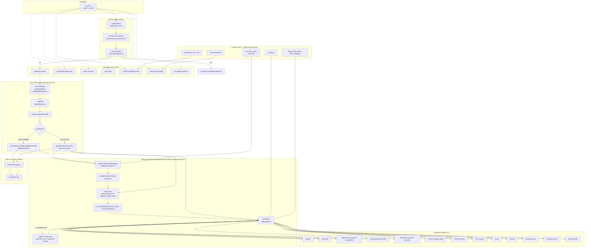

# OpenCommitX — Baseline Code Review

**Branch:** `xb-phase-2` (PR #2 → master, mergeable=CLEAN, CodeRabbit=PASS)
**Snapshot date:** 2026-05-01
**Package version:** 1.0.3
**Bins:** `opencommitx`, `ocox`
**Bundler:** esbuild → `out/cli.cjs`, `out/github-action.cjs`

This is a fork of [di-sukharev/opencommit](https://github.com/di-sukharev/opencommit). It generates AI commit messages for staged diffs, with extensions for caching, smart per-file routing, per-provider keys, fallback models, Python docstring extraction, multi-commit strategies, and a benchmark harness for comparing models.

Use this document as the canonical reference when changing the code — it lists every important file, who calls whom, the config surface, and the open burndown items from PR #2 review.

---

## 1. Executive Summary

| Aspect | Assessment |
| --- | --- |
| Architecture | Single CLI entrypoint (`cli.ts`), per-provider engine plugins behind a thin `AiEngine` interface, file/cache utilities cleanly factored. |
| Test coverage | 9 unit suites + 4 e2e suites. Diff routing, cache, commit strategy, per-provider keys, docstring extractor, config validators all unit-tested. |
| TypeScript hygiene | `strict: true`, but several `as any` escapes (config writes, validator parameters), 6 engines have untyped constructors. |
| CI status | `prettier`, `unit-test`, `e2e-test` jobs on Node 20 + Bun. CodeRabbit review = SUCCESS. |
| Mergeable | Yes per `gh pr view 2`. 13 actionable CR comments, ~20 minors — most appear addressed in commits 28b0916–4198f44. Section 9 maps each to current code. |
| Top risks | Token-budget logic is fragile across providers; OpenAI-style engines independently re-implement size checks; config file is 2000+ lines with duplicated validators; some engine constructors lack types. |

---

## 2. Architecture Flowchart



---

## 3. Repository Layout

```
opencommitx/
├── src/
│   ├── cli.ts                             # Entrypoint — registers cleye commands and dispatches
│   ├── prompts.ts                         # Prompt assembly (system + few-shot user/assistant)
│   ├── prompts/benchmark.ts               # Evaluator prompt for `ocox benchmark`
│   ├── generateCommitMessageFromGitDiff.ts # Core LLM orchestration: budget, chunking, fallback, cache write
│   ├── github-action.ts                   # Compiled to out/github-action.cjs for action.yml
│   ├── version.ts                         # `npm view opencommitx version` for upgrade check
│   ├── CommandsEnum.ts                    # Legacy enum (only config/hook/commitlint) — superseded by commands/ENUMS.ts
│   ├── i18n/                              # 19 locales + index.ts language registry
│   │
│   ├── commands/
│   │   ├── ENUMS.ts                       # Authoritative COMMANDS enum (config/hook/commitlint/setup/models/benchmark)
│   │   ├── commit.ts                      # Top-level commit flow, multi-commit strategy, regenerate UI
│   │   ├── config.ts                      # ⚠ 2008 lines. CONFIG_KEYS, validators, DEFAULT_CONFIG, get/set/describe, OCO_AI_PROVIDER_ENUM
│   │   ├── setup.ts                       # First-run wizard + `ocox setup full`
│   │   ├── githook.ts                     # `ocox hook set/unset` symlink prepare-commit-msg
│   │   ├── prepare-commit-msg-hook.ts     # Code that runs when invoked AS the prepare-commit-msg hook
│   │   ├── models.ts                      # `ocox models list/add/remove` + cache info
│   │   ├── benchmark.ts                   # `ocox benchmark [setup]` — N-way model comparison + evaluator scoring
│   │   ├── commitlint.ts                  # `ocox commitlint get/force` — integration with project's commitlint config
│   │   └── README.md                      # (small, internal)
│   │
│   ├── engine/
│   │   ├── Engine.ts                      # AiEngine interface + AiEngineConfig
│   │   ├── openAi.ts                      # ⭐ Reference engine; others extend or mirror it
│   │   ├── anthropic.ts                   # Native @anthropic-ai/sdk client
│   │   ├── openrouter.ts                  # Uses OpenAI SDK with OpenRouter baseURL; honours OCO_GENERATION_TIMEOUT_SECONDS
│   │   ├── groq.ts                        # extends OpenAiEngine (groq base URL)
│   │   ├── deepseek.ts                    # extends OpenAiEngine (deepseek base URL)
│   │   ├── gemini.ts                      # @google/generative-ai SDK
│   │   ├── azure.ts                       # @azure/openai SDK
│   │   ├── ollama.ts                      # Raw axios → /api/chat
│   │   ├── mlx.ts                         # Raw axios → MLX local server
│   │   ├── mistral.ts                     # @mistralai/mistralai SDK (typed as any)
│   │   ├── aimlapi.ts                     # Raw axios POST
│   │   ├── flowise.ts                     # Raw axios POST with custom payload shape
│   │   └── testAi.ts                      # Deterministic mock used by --dry-run
│   │
│   ├── migrations/
│   │   ├── _migrations.ts                 # Ordered list (00→04)
│   │   ├── _run.ts                        # Tracks completed migrations in ~/.opencommitx_migrations
│   │   ├── 00_use_single_api_key_and_url.ts        # Upstream legacy: collapse provider-prefixed keys → OCO_API_KEY
│   │   ├── 01_remove_obsolete_config_keys_from_global_file.ts # Strip the obsolete keys
│   │   ├── 02_set_missing_default_values.ts         # Backfill DEFAULT_CONFIG entries
│   │   ├── 03_per_provider_api_keys.ts              # Copy OCO_API_KEY → OCO_<PROVIDER>_KEY
│   │   └── 04_migrate_config_location.ts            # ~/.opencommitx → ~/.opencommitx-data/config.ini (best-effort copy, retains legacy as backup)
│   │
│   ├── modules/commitlint/                # commitlint integration (config + crypto + prompts + types + utils + pwd-commitlint)
│   │
│   └── utils/
│       ├── git.ts                         # execa wrappers: assertGitRepo, getStagedFiles, getDiff, getStagedFilesStats (numstat), gitAdd, getStagedFilesStatus
│       ├── diffRouter.ts                  # routeDiff: per-file vs aggregate, dir-affinity grouping, lock-file attachment, docstring override
│       ├── diffChunking.ts                # Splits oversized diffs by file then by hunk; calls engine in parallel-ish
│       ├── splitDiff.ts                   # Pure char/token-budget chunker (no engine deps)
│       ├── mergeDiffs.ts                  # Coalesces small fragments up to maxStringLength
│       ├── tokenCount.ts                  # Singleton tiktoken cl100k_base encoder
│       ├── commitCache.ts                 # Per-repo cache under ~/.opencommitx-data/<repo>-<hash>/, archive on commit, TTL prune
│       ├── commitStrategy.ts              # buildCommitPlan + combineCommitMessages (single vs sequential)
│       ├── pythonDocstringExtractor.ts    # Spawns scripts/extract_docstrings.py + diff hunk-header parsing
│       ├── modelCache.ts                  # ~/.opencommitx-data/models.json (TTL 7d) + per-provider list endpoints
│       ├── customModels.ts                # ~/.opencommitx-custom-models.json (user-supplied model IDs)
│       ├── providerKeys.ts                # getProviderApiKey: provider-specific key with OCO_API_KEY fallback
│       ├── engine.ts                      # getEngine() switch + parseCustomHeaders + re-export of getProviderApiKey
│       ├── engineErrorHandler.ts          # normalizeEngineError: status codes/messages → typed errors
│       ├── errors.ts                      # Custom error classes + isModelNotFoundError + formatUserFriendlyError
│       ├── debugLog.ts                    # writeDebugLog → ~/.opencommitx-data/debug/<ts>-<event>.json
│       ├── benchmarkRunner.ts             # runCandidate, runEvaluator, formatBenchmarkMarkdown (zod-validated)
│       ├── checkIsLatestVersion.ts        # npm view opencommitx version
│       ├── trytm.ts                       # Promise → [value, error] tuple helper
│       ├── removeContentTags.ts           # Strips <think>…</think> blocks from LLM output
│       ├── removeConventionalCommitWord.ts
│       ├── randomIntFromInterval.ts
│       └── sleep.ts
│
├── scripts/
│   └── extract_docstrings.py              # AST-based docstring extractor invoked via spawnSync
│
├── test/
│   ├── jest-setup.ts
│   ├── Dockerfile                         # `oco-test` container for `bun run test:*:docker`
│   ├── unit/                              # 9 suites: config, configValidators, gemini, removeContentTags, perProviderKeys,
│   │                                      #            pythonDocstringExtractor, commitStrategy, diffChunking,
│   │                                      #            diffRouter, commitCache
│   └── e2e/                               # 5 suites: gitPush, noChanges, oneFile, dryRun, prompt-module/commitlint
│
├── .github/
│   ├── workflows/
│   │   ├── test.yml                       # Bun + Node 20: prettier, unit-test, e2e-test
│   │   ├── codeql.yml                     # GitHub-managed JS analysis
│   │   └── dependency-review.yml
│   ├── CONTRIBUTING.md
│   └── ISSUE_TEMPLATE/
│
├── xdocs/                                 # Fork-specific docs (this file lives here)
│   ├── README.md
│   ├── PROMPT_ANALYSIS.md
│   ├── DEPLOYMENT_INSTRUCTIONS.md
│   ├── todo.md
│   ├── plans/                             # Phase plans
│   └── priv/                              # Internal notes (gitignored if needed)
│
├── package.json                           # type=module, packageManager=bun@1.3.13
├── tsconfig.json                          # strict, NodeNext, ES2020 target
├── esbuild.config.js                      # Two builds: cli.cjs + github-action.cjs, copies tiktoken WASM
├── jest.config.ts                         # ts-jest ESM preset, ignores test/e2e/prompt-module/data/
├── .eslintrc.json                         # Legacy flat-disabled config; `lint` script forces `ESLINT_USE_FLAT_CONFIG=false`
├── action.yml                             # GitHub Action runtime: node24, runs out/github-action.cjs
└── todo.md                                # ⚠ Current dev-state (read this before starting work)
```

---

## 4. CLI Entrypoints

| Command | File | Notes |
| --- | --- | --- |
| `ocox` (default) | `src/commands/commit.ts` | Triggers `commit()` after migrations, version check, first-run setup, API key prompt. |
| `ocox config get/set/describe [KEY=VALUE…]` | `src/commands/config.ts:1940` | `set` parses KEY=VALUE or `KEY VALUE`; uses indexOf('=') (handles values containing `=`). |
| `ocox hook set\|unset` | `src/commands/githook.ts` | Symlinks `out/cli.cjs` → `.git/hooks/prepare-commit-msg`. |
| `ocox setup [full]` | `src/commands/setup.ts` | Quick provider+key+model wizard, or full walkthrough. |
| `ocox models [list\|add\|remove] [provider] [model]` | `src/commands/models.ts` | Lists from per-provider API or hard-coded MODEL_LIST; manages user custom models. |
| `ocox benchmark [setup]` | `src/commands/benchmark.ts` | N-way candidate generation + evaluator scoring; writes `benchmark_results_<ts>.md`. |
| `ocox commitlint get\|force` | `src/commands/commitlint.ts` | Generates/reads project commitlint config translation for `OCO_PROMPT_MODULE=@commitlint`. |
| Top-level flags | `src/cli.ts:42–66` | `--fgm` (full GitMoji), `-c/--context`, `-y/--yes`, `-d/--dry-run`. |

When the binary is invoked AS the `prepare-commit-msg` hook, `isHookCalled()` returns true and the flow diverts to `prepareCommitMessageHook` (`src/commands/prepare-commit-msg-hook.ts`).

---

## 5. Configuration Surface (`src/commands/config.ts`)

Authoritative location: `~/.opencommitx-data/config.ini` (legacy `~/.opencommitx` file falls back read-only via `getGlobalConfigPath`/`getGlobalConfig`). Migration 04 copies the legacy file into the new location on first run.

`.env` overrides global config (see `mergeConfigs` at line 1445).

| Key | Type | Default | Group |
| --- | --- | --- | --- |
| `OCO_AI_PROVIDER` | enum | `openai` | provider |
| `OCO_API_KEY` | string | — | provider (legacy generic key) |
| `OCO_API_URL` | string | — | provider |
| `OCO_API_CUSTOM_HEADERS` | JSON | — | provider |
| `OCO_OPENAI_KEY` … `OCO_AZURE_KEY` (9 keys) | string | — | per-provider keys |
| `OCO_MODEL` | string | provider-default | model |
| `OCO_FALLBACK_MODEL` | string | `''` | model |
| `OCO_FALLBACK_PROVIDER` | enum | `''` | model |
| `OCO_TOKENS_MAX_INPUT` | number | 4096 | budget |
| `OCO_TOKENS_MAX_OUTPUT` | number | 500 | budget |
| `OCO_TEMPERATURE` | 0–2 | 0 | generation |
| `OCO_GENERATION_TIMEOUT_SECONDS` | int ≥10 | 90 | generation |
| `OCO_COMMIT_DETAIL` | enum | `normal` | format |
| `OCO_DESCRIPTION` | bool | false | format |
| `OCO_WHY` | bool | false | format |
| `OCO_EMOJI` | bool | false | format |
| `OCO_ONE_LINE_COMMIT` | bool | false | format |
| `OCO_OMIT_SCOPE` | bool | false | format |
| `OCO_LANGUAGE` | i18n | `en` | format |
| `OCO_MESSAGE_TEMPLATE_PLACEHOLDER` | string | `$msg` | format |
| `OCO_PROMPT_MODULE` | enum | `conventional-commit` | format |
| `OCO_PER_FILE_COMMIT_MODE` | auto/always/never | auto | routing |
| `OCO_PER_FILE_THRESHOLD_LINES` | int>0 | 300 | routing |
| `OCO_MAX_FILES_PER_GROUP` | int≥1 | 10 | routing |
| `OCO_MAX_LINES_PER_GROUP` | int≥1 | 1500 | routing |
| `OCO_PYTHON_DOCSTRING_MODE` | auto/always/never | auto | python |
| `OCO_PYTHON_DOCSTRING_THRESHOLD` | int>0 | 500 | python |
| `OCO_PYTHON_DOCSTRING_WHOLE_FILE_RATIO` | 0–1 | 0.9 | python |
| `OCO_MULTI_COMMIT_STRATEGY` | single/sequential | single | multi-commit |
| `OCO_CACHE_ENABLED` | bool | true | cache |
| `OCO_CACHE_TTL_SECONDS` | int>0 | 3600 | cache |
| `OCO_DEBUG` | bool | false | debug |
| `OCO_HOOK_AUTO_UNCOMMENT` | bool | false | hook |
| `OCO_GITPUSH` | bool | true | misc (deprecated) |
| `OCO_TEST_MOCK_TYPE` | enum | `commit-message` | test |

`OCO_AI_PROVIDER_ENUM` (line 1098): `OLLAMA, OPENAI, ANTHROPIC, GEMINI, AZURE, TEST, FLOWISE, GROQ, MISTRAL, MLX, DEEPSEEK, AIMLAPI, OPENROUTER`.

---

## 6. Provider / Engine Matrix

| Provider | Engine class | SDK | Honours `OCO_TEMPERATURE`? | `top_p` when temp=0 | Strips `<think>` | Notes |
| --- | --- | --- | --- | --- | --- | --- |
| openai | `OpenAiEngine` (`openAi.ts:11`) | `openai` | ✓ | 0.1 | ✓ | Reference. Custom headers via `parseCustomHeaders`. |
| anthropic | `AnthropicEngine` (`anthropic.ts:15`) | `@anthropic-ai/sdk` | ✓ | 0.1 (skipped on `claude-*-4-5` due to `temperature+top_p` API restriction) | ✓ | Splits messages into `system` + rest. |
| openrouter | `OpenRouterEngine` (`openrouter.ts:21`) | `openai` against `openrouter.ai/api/v1` | ✓ | 0.1 | ✓ | Honours `OCO_GENERATION_TIMEOUT_SECONDS`; logs raw response when `OCO_DEBUG`. |
| groq | `GroqEngine` (`groq.ts:5`) | extends `OpenAiEngine` | ✓ | 0.1 | ✓ | Just sets baseURL. |
| deepseek | `DeepseekEngine` (`deepseek.ts:10`) | extends `OpenAiEngine` (re-implements method) | ✓ | hard-coded 0.1 | ✓ | Duplicated request logic — drift risk. |
| gemini | `GeminiEngine` (`gemini.ts:15`) | `@google/generative-ai` | ✓ | 0.1 | ✓ | Sets safety settings to `BLOCK_LOW_AND_ABOVE`. |
| azure | `AzureEngine` (`azure.ts:17`) | `@azure/openai` | ✗ (ignored) | — | ✓ | No temperature passthrough. |
| mistral | `MistralAiEngine` (`mistral.ts:14`) | `@mistralai/mistralai` | ✗ (ignored) | hard-coded `topP: 0.1` | ✓ | Client typed as `any`. |
| ollama | `OllamaEngine` (`ollama.ts:9`) | axios → `/api/chat` | ✓ | hard-coded 0.1 | ✓ | Constructor untyped (`config` param has no annotation). |
| mlx | `MLXEngine` (`mlx.ts:9`) | axios → MLX server | ✓ | hard-coded 0.1 | ✓ | Constructor untyped. |
| aimlapi | `AimlApiEngine` (`aimlapi.ts:8`) | raw axios | ✗ (no temp passthrough) | — | ✗ (does NOT strip `<think>`) | Simple POST. |
| flowise | `FlowiseEngine` (`flowise.ts:9`) | axios with custom payload | ✗ | — | ✓ | Constructor untyped; assumes baseURL+apiKey concatenation. |
| test | `TestAi` (`testAi.ts:16`) | none | n/a | n/a | n/a | Returns deterministic message; used by `--dry-run`. |

`getEngine()` (`utils/engine.ts:43`) is the dispatcher; it reads the resolved API key via `getProviderApiKey`.

---

## 7. Core Data Flow

### 7.1 Commit happy-path (aggregate mode)

1. `cli.ts` → `commit(extraArgs, context, false, fgm, yes||dryRun)` (line 99)
2. `commit.ts:778` → `pruneArchivedCache`, `getStagedFiles`, `getChangedFiles`
3. `commit.ts:884` → `routeDiff(stats, config)` returns `{ usePerFile, fileGroups, reason }`
4. `commit.ts:944` → render staged-files table (file / +N/-M / New / DS / Grp)
5. If `usePerFile=false`: `getDiff({ files: stagedFiles })` → `generateCommitMessageFromGitDiff(...)`
6. Inside generator (`generateCommitMessageFromGitDiff.ts:326`):
   - `getCachedCommitMessage(diff)` → cache hit prompts user to "Use cached" or regenerate
   - `generateCommitMessageByDiff(diff, fgm, context)` builds prompt, runs token check, calls engine
   - On success: `setCachedCommitMessage`, present `performCommit` UI (Yes/No/Edit/Regenerate)
   - On commit success: `archiveCacheEntry`, `handleGitPush`

### 7.2 Per-file path (`generatePerFileCommits` in `commit.ts:489`)

- Iterates `fileGroups` sequentially (NOT parallel — that broke @clack spinner / WASM).
- Each group:
  - Uses `group.docstringOverride` if present (whole-file Python docstring extract), else `getDiffForFiles(group.files)`.
  - Cache lookup → optional model-mismatch confirmation.
  - LLM call wrapped in `Promise.race` with `OCO_GENERATION_TIMEOUT_SECONDS` timeout.
  - Cache the message immediately (so a later group failure doesn't lose earlier work).
- `buildCommitPlan` (`utils/commitStrategy.ts:13`) zips groups↔messages (throws on mismatch length).
- `single` strategy: `combineCommitMessages` joins, single `git commit`.
- `sequential` strategy: `git reset HEAD --` first, then for each group `git add -- <files>` → present (Accept/Edit/Skip/AcceptAll) → `git commit`. Files excluded from diff (e.g. lockfiles) are appended to last group.

### 7.3 Token-budget logic (`generateCommitMessageFromGitDiff.ts:204`)

- `MAX_REQUEST_TOKENS = OCO_TOKENS_MAX_INPUT - 20 - prompt overhead`.
- Throws early if `<= 0`.
- If `tokenCount(diff) >= MAX_REQUEST_TOKENS`:
  - **Pre-processed payload (no `diff --git` headers):** truncate by lines until fit, send as single request.
  - **Python files in diff:** try docstring extraction fallback before chunking.
  - **Otherwise:** `getCommitMsgsPromisesFromFileDiffs` chunk-and-join (sequentially, with `delay(2000)` between chunks).
- Otherwise: enrich diff with Python docstrings (when budget allows) and call engine once.

### 7.4 Diff routing (`utils/diffRouter.ts:156`)

- `mode='never'`: single aggregate group (lock files included).
- `mode='always'`: every non-boilerplate file is its own group; boilerplate (`__init__.py`, `index.ts`, `mod.rs`, etc.) clustered together; lock files attached to manifest group.
- `mode='auto'`: each file with `added+deleted > threshold` becomes its own group; small files greedily packed by directory affinity respecting `OCO_MAX_FILES_PER_GROUP` and `OCO_MAX_LINES_PER_GROUP`. Lock files attached to their manifest's group; orphans go to last group.
- Returns `RoutingResult { usePerFile, fileGroups: [{ files, totalLines, docstringOverride? }], reason }`.

### 7.5 Cache (`utils/commitCache.ts`)

- Per-repo dir: `~/.opencommitx-data/<repoName>-<sha256(repoRoot)[0:8]>/<diffHash>.json`.
- Hash: `sha256` over diff with trailing-whitespace-only normalization (preserves internal spacing — see CR comment status §9).
- Files are 0o600. `getCachedCommitMessage` archives expired entries on read. `archiveCacheEntry` moves entry to `archived/` after successful commit. `pruneArchivedCache` runs on startup with retention based on `OCO_CACHE_TTL_SECONDS`.

### 7.6 Fallback model (`generateCommitMessageFromGitDiff.ts:530`)

Triggered when error message contains `rate limit`, `429`, `overloaded`, `unavailable`, `timeout`, or is a `ModelNotFoundError`. Lower-cases error message before substring check (CR feedback applied). On model-naming-convention mismatch (e.g. OpenRouter's `provider/model` vs Anthropic native), prompts user for `OCO_FALLBACK_PROVIDER` interactively. Persists `lastUsedModel` so the cache records the actual model that produced the message.

---

## 8. Tests

**Unit (`test/unit/`):**

| Suite | Coverage |
| --- | --- |
| `config.test.ts` | `getConfig`/`setConfig` precedence, JSON header parsing, null override |
| `configValidators.test.ts` | per-validator behaviour |
| `gemini.test.ts` | (skipped — pre-existing upstream issue per todo.md) |
| `removeContentTags.test.ts` | `<think>` stripping incl. nested |
| `perProviderKeys.test.ts` | OCO_<PROVIDER>_KEY → fallback chain |
| `pythonDocstringExtractor.test.ts` | `shouldUseDocstringMode` + integration when Python available |
| `commitStrategy.test.ts` | `buildCommitPlan` / `combineCommitMessages` / `isValidCommitStrategy` |
| `diffChunking.test.ts` | hunk-boundary preservation |
| `diffRouter.test.ts` | dependency-injected `_shouldUse`/`_extract`, all three modes, dir affinity, lock-file attachment |
| `commitCache.test.ts` | `hashDiff` whitespace semantics, set/get/expire/archive/clear |

**E2E (`test/e2e/`):**

| Suite | Coverage |
| --- | --- |
| `gitPush.test.ts` | end-to-end `ocox` against a temp repo |
| `noChanges.test.ts` | empty-stage path |
| `oneFile.test.ts` | single-file commit |
| `dryRun.test.ts` | `--dry-run` test mock |
| `prompt-module/commitlint.test.ts` | commitlint-driven prompt with multiple commitlint versions (9/18/19) |

`bun run test:e2e` requires `test:e2e:setup` (sh script) and a writable git environment; covered in the `e2e-test` GH Actions job.

---

## 9. PR #2 CodeRabbit Burndown

PR #2 is currently mergeable (`mergeStateStatus: CLEAN`) and CodeRabbit's overall status is SUCCESS, but CodeRabbit posted **13 actionable inline comments** (some marked Critical/Major). Below is the current state of each, verified against HEAD (`4198f44 v1.0.3`).

### 9.1 Critical

| File:line | Issue | Status @ HEAD | Action needed |
| --- | --- | --- | --- |
| `src/commands/benchmark.ts:114` | `text()` prompts (evalTemp/evalMaxIn/evalMaxOut, candidate `cTemp`) lacked cancellation guards → would crash if user cancels. | **✓ Fixed** — `isCancel(evalTemp)` etc. now present at lines 95, 105, 115; `cTemp` guarded at 151. | None. |
| `src/commands/config.ts:1203` | `initGlobalConfig` could ENOENT because parent dir `~/.opencommitx-data/` may not exist. | **✓ Fixed** — `mkdirSync(dirname(configPath), { recursive: true })` at line 1278 inside `initGlobalConfig`; same in `setGlobalConfig` at line 1373. | None. |

### 9.2 Major

| File:line | Issue | Status | Action needed |
| --- | --- | --- | --- |
| `src/commands/commit.ts:584` | `isCancel(reuseAction)` was treated as "use cached". | **✓ Fixed** — explicit `if (isCancel(reuseAction)) process.exit(1);` at line 582 separated from `if (reuseAction === 'use')`. | None. |
| `src/commands/config.ts:1997` | `kv.split('=')` truncated values containing `=`. | **✓ Fixed** — uses `kv.indexOf('=')` then `slice` at lines 1991–1996. | None. |
| `src/commands/config.ts:948` | Validators too permissive: `OCO_DEBUG` silently coerces, timeout allows non-integers, `OCO_FALLBACK_PROVIDER` accepts any string. | **Partially fixed** — `OCO_FALLBACK_PROVIDER` now whitelisted (line 1086–1094). `OCO_DEBUG` validator at line 939 accepts arbitrary strings → still coerces. `OCO_GENERATION_TIMEOUT_SECONDS` requires `Number.isInteger(n) && n >= 10` (line 1074) — fixed. | Tighten `OCO_DEBUG` to reject non-boolean/non-recognised-string values. |
| `src/engine/openrouter.ts` | Hard-coded `60_000` timeout. | **✓ Fixed** — `(getConfig().OCO_GENERATION_TIMEOUT_SECONDS ?? 60) * 1000` at line 25. | None. |
| `src/generateCommitMessageFromGitDiff.ts:~568` | Fallback key prompt always overwrote `OCO_API_KEY`. | **Partially fixed** — line 612–616 only writes the provider-specific key (`OCO_<P>_KEY`). Generic `OCO_API_KEY` is no longer overwritten. | None. |
| `src/generateCommitMessageFromGitDiff.ts:432` | Chunked path could return empty string silently. | **✓ Fixed** — line 422 throws `emptyMessage` when `commitMessages.length === 0`; per-chunk guard at line 418 (`if (msg) commitMessages.push(msg)`). | None. |
| `src/generateCommitMessageFromGitDiff.ts:~510` | Retriable-error detection was case-sensitive. | **✓ Fixed** — line 535 lower-cases via `.toLowerCase()`. | None. |
| `src/prompts.ts:171–179` | `concise` mode appended `detailInstruction` alongside contradictory description/why guidance. | **✓ Fixed** — `isConcise` short-circuits description/why at lines 174–177. | None. |
| `src/utils/benchmarkRunner.ts:221` | Evaluator only supported certain providers; allowed unsupported via cast. | **✓ Fixed** — `OPENAI_COMPATIBLE_EVALUATOR_PROVIDERS` whitelist at line 53; throws clear error at line 184. | None — but the whitelist is opinionated; consider extending if other providers gain OpenAI-compatible endpoints. |
| `src/utils/benchmarkRunner.ts:180` | Ranking keyed by bare model id collided when same model used across providers. | **✓ Fixed** — keys are `model@provider` (lines 177, 252, 263–264). | None. |
| `src/utils/benchmarkRunner.ts:236` | `JSON.parse(jsonStr)` cast without schema validation. | **✓ Fixed** — `BenchmarkEvalResponseSchema` (zod) validates at line 231. | None. |
| `src/utils/commitCache.ts:102` | Hash normalization collapsed internal whitespace → cache collision on whitespace-significant edits. | **✓ Fixed** — line 97 uses `line[0] + line.slice(1).trimEnd()` (trailing only). | None. |
| `src/utils/debugLog.ts` | `event` field could be path-traversal vector if untrusted. | **✓ Fixed** — line 33 sanitises with `replace(/[^a-zA-Z0-9_-]/g, '_')`. | None. |
| `src/utils/diffChunking.ts:67` | `diffByFiles = diff.split(separator).slice(1)` lost separators after merge. | **✓ Fixed** — line 64 maps `(s) => separator + s` so separators are restored. | None. |
| `src/utils/diffRouter.ts:179` | `mode='never'` dropped lock files and could emit `files: []`. | **✓ Fixed** — line 173 includes both `relevantStats` and `lockFiles` for `never` mode. | None. |
| `src/utils/diffRouter.ts:170` | Arbitrary binary/generated files (`.png`, `.min.js`, `.wasm`) attached to last group when no manifest matches. | **Not fixed** — current `attachLockFiles` at line 320 still falls back to `groups[groups.length - 1]` for any orphaned binary/generated file. CR-suggested fix splits "true lock files" (have manifest) from "standalone generated assets" (own group). | Apply CR's split: only attach to last group when `getLockManifestPath` is non-null; otherwise create a dedicated group. |
| `src/utils/errors.ts:228` | Error help text said `oco config set …` not `ocox`. | **✓ Fixed** — `errors.ts:233` now reads `ocox config set OCO_MODEL=…`. | None. |
| `src/utils/splitDiff.ts:38` | Char-budget truncation assumed 4 chars/token; under-counts CJK / token-dense content. | **Partially mitigated** — line 31–34 derives `charBudget` dynamically from actual `tokenCount(line)/line.length`. Edge case where `lineTokens` momentarily plateaus is now safe but worth a unit test. | Add test for token-dense content (e.g. CJK or minified blob). |
| `src/utils/splitDiff.ts` | (file-level) Could push empty chunk; always prefixed `\n` on first line. | **✓ Fixed** — line 47 `currentDiff ? currentDiff + '\n' + line : line` and the only `splitDiffs.push(subLine)` runs after a successful substring slice (charBudget≥1). | None — though the empty-chunk guard could be added defensively. |

### 9.3 Minor

| File:line | Issue | Status | Action needed |
| --- | --- | --- | --- |
| `scripts/extract_docstrings.py:105` | Unknown `--flag` args silently ignored. | **✓ Fixed** — lines 106–111 reject unknown flags with usage message. | None. |
| `src/commands/benchmark.ts:339` | Score lookup used `r.candidate.model` not `model@provider`. | **✓ Fixed** — line 338 uses `benchmarkCandidateKey(r.candidate)`. | None. |
| `src/commands/commit.ts` (regen) | `setCachedCommitMessage` after regen lacked `consumeLastUsedModel`. | **✓ Fixed** — line 451–455 in regen path passes `consumeLastUsedModel() ?? undefined`. | None. |
| `src/commands/commit.ts` (forEach pattern) | Biome lint `useIterableCallbackReturn`. | Cosmetic; ESLint config used here, not Biome — no action required unless project switches lint engines. | None. |
| `src/commands/config.ts` (legacy source label) | Help printout could say new path while reading legacy. | **✓ Fixed** — `printAllConfigHelp` (line 1899) uses `getGlobalConfigPath` then `formatConfigSource` (line 1406) which distinguishes new/legacy/.env paths. | None. |
| `src/commands/config.ts:1095` | Validators heavily annotated `value: any`. | Cosmetic; doesn't affect behaviour. | Long-term refactor — type validators against `ConfigType` keys. |
| `src/commands/setup.ts:853` | `toPositiveNumber` for `OCO_GENERATION_TIMEOUT_SECONDS` allowed 1–9 to bypass `≥10` validator. | **Not fixed** — `setup.ts:846` still uses `toPositiveNumber` (which only checks `>0`). The eventual `setConfig` call later in setup will run validator and reject — but that's a worse UX than catching it inline. | Tighten `toPositiveNumber` call site to require `≥10` for this key. |
| `src/engine/openrouter.ts:8` | Empty `interface` extending `AiEngineConfig`. | Cosmetic ESLint complaint (`no-empty-object-type`). | Replace with `type OpenRouterConfig = AiEngineConfig;` (also applies to `groq.ts`, `deepseek.ts`, `mistral.ts`, `aimlapi.ts`, `azure.ts`, `flowise.ts`, `gemini.ts`, `mlx.ts`, `ollama.ts`). |
| `src/utils/benchmarkRunner.ts` (`thinkBlock`) | Always rendered "Evaluator Raw Response" section. | **✓ Fixed** — line 300 condition is `rawEval.trim().length > 0`. | None. |
| `src/utils/diffRouter.ts:286` (totalLines on attach) | Lock file attached without updating group `totalLines`. | **✓ Fixed** — `attachLockFiles` at line 325 now does `targetGroup.totalLines += lockStat.added + lockStat.deleted`. | None. |

### 9.4 Source B — review-body items from the most recent review (2026-04-29)

The 4 Apr-29 inline comments are already accounted for above (they're items in §9.2/§9.3). The review's **body** (Source B in `/fetch-reviews`) carried 1 duplicate (re-flag) and 11 nitpicks that aren't inline. Each verified against HEAD:

| Severity | File:line | Issue | Status @ HEAD | Decision |
| --- | --- | --- | --- | --- |
| Major (re-flag) | `src/utils/diffChunking.ts:46-47` | `getMessagesPromisesByChangesInFile` prepends `separator` (`'diff --git '`) onto a `lineDiff` that already starts with that prefix (from the caller's earlier `.map((s) => separator + s)` on line 64) → final payload becomes `'diff --git diff --git ...'`. Only fires on the chunking fallback path (huge diffs). | **Not fixed** — confirmed line 47: `await buildMessages(separator + lineDiff)`. | **Active.** Real bug; fix by dropping the `separator +` here (or pass `''` from the caller). |
| Nitpick | `src/utils/diffChunking.ts:67-77` | "Also applies to" — the `else` branch on line 80 does `await buildMessages(separator + fileDiff)` even though `fileDiff` already includes `diff --git `. Same root cause as above. | **Not fixed** — line 80. | **Active.** Folds into the same fix. |
| Nitpick | `src/generateCommitMessageFromGitDiff.ts:11` | Unused `MODEL_LIST` import. | **Not fixed** — line 11. | Active (cosmetic). |
| Nitpick | `src/migrations/04_migrate_config_location.ts:3` | Unused `dirname` import. | **Not fixed** — line 3. | Active (cosmetic). |
| Nitpick | `test/unit/commitCache.test.ts:1-3` | Unused imports `mkdirSync`, `homedir`, `pathJoin`. | **Not fixed** — confirmed by grep. | Active (cosmetic). |
| Nitpick | `src/commands/benchmark.ts:17-37` | Unused imports `CONFIG_KEYS`, `PROVIDER_API_KEY_URLS`, `getConfig`, `setConfig`, `getProviderApiKey`. | **Not fixed** — all 5 still imported, none used. | Active (cosmetic). |
| Nitpick | `src/commands/benchmark.ts:231` | `const estimatedInputTokens` computed but never read — only `evalEstimate` is shown in the note. | **Not fixed.** | Active. Either delete or include in the user-facing note (the note text would read better with both numbers). |
| Nitpick | `src/utils/commitCache.ts:219` | Stale comment "Use unlinkSync via dynamic import to avoid direct fs import" left over from before `unlinkSync` was added to the top-level import. | **Not fixed.** | Active (cosmetic). |
| Nitpick | `src/commands/commit.ts:890` | `let stats` never reassigned — should be `const`. | **Not fixed.** | Active (cosmetic). |
| Nitpick | `src/commands/setup.ts:832-835` | Temperature wizard silently swallows invalid input (e.g. `5.0`) instead of warning the user. | **Not fixed.** | Active. Same pattern as the other "Should-do" item below for `OCO_GENERATION_TIMEOUT_SECONDS`; both should at least warn. |
| Nitpick | `src/utils/modelCache.ts:130, 151, 174-179, 200` | Provider-list fetch responses parsed as inline `(m: { id: string })`. Coding guidelines call for Zod schema validation at the API boundary. | **Not fixed.** | **Deferred.** Lots of churn for low real-world impact (these calls already fall back to `MODEL_LIST` on any error). Reasonable cleanup if/when modelCache gets refactored, but not blocking. |
| Nitpick | `src/prompts/benchmark.ts:57-58` | Evaluator system prompt says "Return ONLY valid JSON" *and* "Do NOT omit the `<think>` tag if you use one". `benchmarkRunner.ts:227` works around it with a regex extract, so output is parseable, but the prompt itself is contradictory and may degrade JSON quality on smaller models. | **Not fixed.** | Active (low priority). Worth tightening to "if you use a `<think>` block, place it before the JSON object — extraction will pull the JSON out". |
| **Skipped** | `xdocs/README.md:294` (Apr 29 nitpick) | "Capitalize 'GitHub'" — the suggested diff is literally identical to the existing line; the heading on line 292 already reads `## CI / GitHub Actions`; line 294 doesn't contain the word "GitHub" at all (only the directory `.github/workflows/`). | n/a | **Skip — false positive.** The CR suggestion is malformed. |
| **Skipped** | `xdocs/todo.md:25-26` (Apr 27 nitpick) | "TOO_MUCH_TOKENS" → "TOO_MANY_TOKENS" naming. The actual enum value in `generateCommitMessageFromGitDiff.ts:71` is `tooMuchTokens = 'TOO_MUCH_TOKENS'` so the docs reference is accurate. Renaming the enum is wider scope than a doc fix. | n/a | **Skip — defer.** Doc reference matches code; renaming the enum is a separate (low-value) refactor. |

### 9.5 Updated burndown summary

- **Must-do before merge:** none — PR is technically mergeable, but the `diffChunking` duplicated-prefix bug is a real Major that affects chunking-fallback prompt quality. Worth burning down too.
- **Should-do soon (Major or behaviour-affecting):**
  1. `src/utils/diffChunking.ts:46-47` and `:80` — drop the extra `separator +` prefix when the caller already supplied a `diff --git`-prefixed payload (Apr 29 duplicate-flag).
  2. `src/utils/diffRouter.ts:170` — stop attaching arbitrary `.png`/`.wasm`/`.min.*` to an unrelated commit group; give them their own group when no manifest matches.
  3. `src/commands/config.ts:939` — `OCO_DEBUG` validator should reject invalid values, not silently coerce to `false`.
  4. `src/commands/setup.ts:846` — enforce `OCO_GENERATION_TIMEOUT_SECONDS ≥ 10` at wizard time (not just at config-set time).
  5. `src/commands/setup.ts:832-835` — surface a "value ignored" warning when a temperature outside `0–2` is entered (mirrors the timeout pattern).
- **Cosmetic cleanup (lint/imports — fast, batchable):**
  - Remove unused imports in `generateCommitMessageFromGitDiff.ts:11` (`MODEL_LIST`), `migrations/04_migrate_config_location.ts:3` (`dirname`), `test/unit/commitCache.test.ts:1-3` (`mkdirSync`, `homedir`, `pathJoin`), `commands/benchmark.ts:17-37` (5 symbols).
  - Remove unused `estimatedInputTokens` in `benchmark.ts:231` (or include it in the note alongside `evalEstimate`).
  - Remove stale "dynamic import" comment in `commitCache.ts:219`.
  - `let stats` → `const stats` in `commit.ts:890`.
  - Replace empty `interface X extends AiEngineConfig {}` declarations with `type X = AiEngineConfig;` across `engine/openrouter.ts:8`, `groq.ts`, `deepseek.ts`, `mistral.ts`, `aimlapi.ts`, `azure.ts`, `flowise.ts`, `gemini.ts`, `mlx.ts`, `ollama.ts`.
- **Nice-to-have:**
  - Tighten `prompts/benchmark.ts:57-58` evaluator instruction to remove the contradiction.
  - Add CJK/dense-token test for `splitDiff`.
  - Add explicit empty-chunk guard in `splitDiff.push(subLine)`.
- **Deferred / skipped:**
  - `modelCache.ts` Zod-validation refactor (low value; falls back gracefully today).
  - `xdocs/README.md:294` "GitHub" capitalisation (CR false positive — pre/post diff identical).
  - `xdocs/todo.md:25-26` `TOO_MUCH_TOKENS` rename (matches the actual enum value; not a doc bug).

---

## 10. Independent Findings (not in CR review)

### 10.1 Bugs / Correctness

1. **`src/commands/githook.ts:24`** — `isHookCalled` checks `process.argv[1].endsWith(hooksPath)`. On Windows the hook target written by `ocox hook set` is a forward-slash path (`.git/hooks/prepare-commit-msg`) but Node may surface argv with backslashes. Worth a manual test on Windows; currently no Windows-specific normalisation.
2. **`src/commands/prepare-commit-msg-hook.ts:42`** — Reads `config.OCO_API_KEY` directly instead of `getProviderApiKey(config, provider)`. With per-provider keys, a user who only set `OCO_ANTHROPIC_KEY` would see "No OCO_API_KEY is set" when invoking via the hook. Diverges from `cli.ts`'s `promptForMissingApiKey` behaviour.
3. **`src/utils/git.ts:7-13`** — `assertGitRepo` re-throws the error as `new Error(error as string)`; if `error` is an `Error` object the message becomes `[object Object]`. Should be `String(error)` or pass through the original.
4. **`src/utils/git.ts:99-121`** — `getDiff` filters out lock files by substring match (`includes('.lock')`, `includes('-lock.')`). This is too coarse: a file like `src/lockfile.ts` would be filtered out. The router's `isBinaryOrGenerated` is more careful.
5. **`src/engine/ollama.ts:23-27`** — When `config.baseURL` is provided, the URL is `${baseURL}/${apiKey}` — concatenating an API key into a URL path is unusual; suspect this is dead code from when Ollama spawned a local server with a token. For local Ollama, `apiKey` is `'ollama'`, so the resulting URL is e.g. `http://localhost:11434/api/chat/ollama`, which is wrong. Confirm whether this works in practice.
6. **`src/engine/aimlapi.ts:38`** — Does NOT call `removeContentTags(content, 'think')`. Inconsistent with all other engines; reasoning-model output from aimlapi will leak `<think>` blocks.
7. **`src/migrations/00_use_single_api_key_and_url.ts:34-39`** — `else throw new Error("Migration failed, set AI provider first…")` will hard-fail migrations on any unknown provider (e.g. groq, openrouter, mistral, deepseek, mlx). The runner's `SKIP_MIGRATION00_PROVIDERS` set covers some of these but not all (missing `aimlapi`, `flowise`, `test`). If a new install sets one of those providers before the migration system has marked migration00 as skipped, the user will hit this throw.
8. **`src/utils/checkIsLatestVersion.ts:7`** — Synchronous `execa('npm', …)` runs on every invocation, blocking on a network call. Cache the last-checked timestamp under `~/.opencommitx-data/` to avoid hitting npm on every commit (impacts commit latency by 200-2000ms).
9. **`src/commands/commit.ts:786-788`** — Cache-retention computation uses `Math.ceil(... / 86400)`, but if `OCO_CACHE_TTL_SECONDS=300` (5 min) the retention is 1 day — fine. If `0`, falls back to 7. Edge: when set, `Math.ceil(0)` would be 0 — but the validator requires `>0`, so safe.
10. **`src/utils/diffChunking.ts:81`** — Within the non-overflow branch, `engine.generateCommitMessage(messages)` is pushed as a hot promise that runs immediately. Earlier code in `generateCommitMessageFromGitDiff.ts:403-420` then iterates these promises with `await`+`delay(2000)` — but since the promises are already running in parallel, the delay only spaces out the `await`s, not the API calls. This means rate-limit pacing is largely ineffective when chunks were started concurrently.

### 10.2 Code-quality / Maintainability

1. **`src/commands/config.ts` is 2008 lines.** It owns the provider enum, model lists (huge `openrouter` list with 300+ entries), validators, defaults, env parsing, persistence, describe/help printer, AND the cleye command handler. Worth splitting into:
   - `commands/config.ts` (cleye handler only)
   - `config/keys.ts` (CONFIG_KEYS, ConfigType, OCO_AI_PROVIDER_ENUM)
   - `config/models.ts` (MODEL_LIST, RECOMMENDED_MODELS, PROVIDER_API_KEY_URLS)
   - `config/validators.ts`
   - `config/storage.ts` (getConfig/setConfig/initGlobalConfig)
   - `config/help.ts` (printConfigKeyHelp/printAllConfigHelp/THEMATIC_KEY_ORDER)
2. **Engine duplication.** `OpenAiEngine`, `DeepseekEngine`, `AnthropicEngine`, `MistralAiEngine`, `AzureEngine` each contain a near-identical "REQUEST_TOKENS pre-flight check → throw GenerateCommitMessageErrorEnum.tooMuchTokens" block. Extract into a shared `assertWithinBudget(messages, config)` helper.
3. **Untyped engine constructors** (`gemini.ts`, `ollama.ts`, `mlx.ts`, `flowise.ts`) — silent `any` despite project being `"strict": true`.
4. **`src/CommandsEnum.ts`** is a stale duplicate of the authoritative `src/commands/ENUMS.ts`. Backlog item already notes "Sync ENUMS.ts to add new subcommands formally" — this file can probably be deleted entirely.
5. **`src/commands/githook.ts`** uses the upstream's user-facing string `"OpenCommit"` and command `oco config set …` (line 47, 78, 85, 96). Was missed during the `oco→ocox` rename; mostly affects hook set/unset error messages.
6. **`src/utils/git.ts:15-17`** — commented-out `excludeBigFilesFromDiff` array with `:(exclude)` pathspec syntax. Either implement it or delete it.
7. **`src/migrations/02_set_missing_default_values.ts:17`** — `console.log(entriesToSet);` appears intentional debug, but is shipped in release builds. Removed in release notes? Replace with `outro(...)` or guard behind `OCO_DEBUG`.
8. **`generateCommitMessageFromGitDiff.ts:155`** — `setGlobalConfig({ ...existingConfig, OCO_MODEL: newModel } as any);` — the `as any` cast hides whether the partial type matches `ConfigType`. Fix the type or use `ConfigType` Partial<>.
9. **`src/prompts.ts:155-184`** — Mix of imperative IIFE and string interpolation; readable but non-trivial to test. The system prompt has 9 dynamic segments — consider extracting into a structured prompt builder (`{ identity, mission, convention, …, generalGuidelines, userContext }.filter(Boolean).join('\n')`).
10. **Test coverage gap:** there is no unit test for `engineErrorHandler.normalizeEngineError`. Given how central the typed-error mapping is (every engine routes through it), this is the highest-value test to add.

### 10.3 Security / Privacy

1. **`src/commands/config.ts:651`** — `validateConfig` writes the offending value to stdout (`wrong value for ${key}: ${validationMessage}`). For secrets like `OCO_*_KEY`, this could log the key fragment when the value fails type coercion. Mask values for keys ending in `_KEY`.
2. **`src/utils/debugLog.ts`** — `OCO_DEBUG=true` writes full LLM prompt + response (which includes the entire diff and the system prompt with project-specific commit conventions) to `~/.opencommitx-data/debug/`. Files are world-readable by default (`writeFileSync` default `0o644`). Should be `0o600` like `commitCache` files.
3. **`src/commands/config.ts:744-747`** — Unsupported language list logged via `${supportedLanguages}` without explicit `.join(', ')`. Cosmetic but messy: prints `[object Object]`-style array string.
4. **API keys in plain text** — Already noted to user in `setup.ts:179-184`. Worth following up by documenting "use OS keychain" as a future option (or supporting the `keytar` npm package).
5. **`src/utils/commitCache.ts:117-119`** — `JSON.parse(readFileSync(file, 'utf-8'))` with no schema validation. Stale or hand-edited cache entries with bad shape silently `return null`, but a malicious file could inject huge strings. Low-impact; constrain expected shape.

### 10.4 Performance

1. **`src/utils/tokenCount.ts`** — Singleton tiktoken encoder is correctly cached; this fix (per todo.md Phase 2) is good. Confirm the WASM bundle ships properly (esbuild copies it; visible in `package.json` files).
2. **`generateCommitMessageFromGitDiff.ts:227-229`** — Builds prompt then calls `tokenCount` on each message — for a 3-message prompt this is 3 separate WASM calls. Could batch with one call on the joined string.
3. **`utils/git.ts:147-170`** — `getStagedFilesStats` runs `git diff --staged --numstat` and `getStagedFilesStatus` runs `git diff --staged --name-status`; called sequentially in `commit.ts`. Both could run in parallel via `Promise.all`.
4. **`src/utils/commitCache.ts:50-67`** — `getRepoCacheDir` calls `execSync('git rev-parse --show-toplevel')` on every cache lookup. With the per-file commit flow, this fires once per group. Cache the result for the process lifetime.

### 10.5 Build / Release

1. **`package.json`** dep `"crypto": "^1.0.1"` — this is the abandoned fork on npm, not Node's built-in module. Node's `crypto` is available without a dep. Removing this line eliminates a transitive vulnerability vector and shrinks `node_modules`.
2. **`package.json` `bin`** — points only at `out/cli.cjs`. Dev environments rely on `npm run dev` (ts-node) — no per-command dev shortcut beyond `dev:gemini`. Add `dev:dry` (`ts-node ./src/cli.ts --dry-run`) for quick sandbox runs.
3. **`esbuild.config.js`** — no `minify` or `treeshake` directives; `out/cli.cjs` is ~2.6 MB (per `opencommitx-1.0.3.tgz` size). todo.md backlog already captures "Reduce bundle size".
4. **`.github/workflows/test.yml`** — only Node 20.x. `action.yml` uses `node24`. Worth aligning, or testing against `[20.x, 22.x]` matrix.
5. **`tsconfig.json` `include: ["test/jest-setup.ts"]`** is unusual — implies the rest of the source is picked up implicitly. Confirm builds use entrypoints, not the tsconfig include set, for compilation.
6. **Three duplicate `formatCacheAge` functions** exist: `commitCache.ts:259`, `models.ts:20`, `setup.ts:189`. Consolidate into one util.

### 10.6 Documentation

1. `src/commands/README.md` exists but wasn't read; small, but mention if it duplicates anything in xdocs.
2. `xdocs/README.md`, `xdocs/PROMPT_ANALYSIS.md`, `xdocs/DEPLOYMENT_INSTRUCTIONS.md`, `xdocs/todo.md` are the user-facing fork docs. The fork-author plans live in `xdocs/plans/`.
3. The root `README.md` (17K) is mostly inherited from upstream; spot-check that all commands shown still match (`oco` vs `ocox`, OCO_* keys current, etc.).

---

## 11. Quick-reference index

| Need… | Look at |
| --- | --- |
| CLI entrypoint | `src/cli.ts` |
| All CONFIG_KEYS + defaults + validators | `src/commands/config.ts` (lines 13–65, 653–1096, 1234–1275) |
| Resolve provider key | `src/utils/providerKeys.ts:7` (`getProviderApiKey`) |
| Engine instantiation | `src/utils/engine.ts:43` (`getEngine`) |
| Engine interface | `src/engine/Engine.ts` |
| Top-level commit flow | `src/commands/commit.ts:778` (`commit()`) |
| Per-file commit flow | `src/commands/commit.ts:489` (`generatePerFileCommits`) |
| LLM call orchestration | `src/generateCommitMessageFromGitDiff.ts:204` (`generateCommitMessageByDiff`) |
| Prompt assembly | `src/prompts.ts:259` (`getMainCommitPrompt`) |
| Diff routing decisions | `src/utils/diffRouter.ts:156` (`routeDiff`) |
| Cache key + lifecycle | `src/utils/commitCache.ts` (`hashDiff`, `getCachedCommitMessage`, `archiveCacheEntry`, `pruneArchivedCache`) |
| Token counting | `src/utils/tokenCount.ts:22` |
| Diff chunking | `src/utils/diffChunking.ts:56` (`getCommitMsgsPromisesFromFileDiffs`) + `src/utils/splitDiff.ts:13` |
| Python docstring path | `src/utils/pythonDocstringExtractor.ts` + `scripts/extract_docstrings.py` |
| Per-provider model list refresh | `src/utils/modelCache.ts:208` (`fetchModelsForProvider`) |
| Custom user models | `src/utils/customModels.ts` (`~/.opencommitx-custom-models.json`) |
| Error normalisation | `src/utils/engineErrorHandler.ts:127` (`normalizeEngineError`) |
| User-friendly error formatting | `src/utils/errors.ts:353` (`formatUserFriendlyError`) |
| Fallback model retry logic | `src/generateCommitMessageFromGitDiff.ts:530` |
| Migration runner | `src/migrations/_run.ts:72` (`runMigrations`) |
| Setup wizard | `src/commands/setup.ts:408` (`runSetup`) / `runFullSetup` line 575 |
| Benchmark runner | `src/utils/benchmarkRunner.ts` |
| Benchmark prompt | `src/prompts/benchmark.ts` |
| GitHub Action entry | `src/github-action.ts` |
| Hook installation | `src/commands/githook.ts` |
| When invoked AS hook | `src/commands/prepare-commit-msg-hook.ts` |

---

## 12. Open backlog (from `todo.md`, retained for context)

- Context window sharing strategy for multi-chunk requests
- Smart model routing (estimate tokens → cheap vs expensive)
- i18n for new CLI messages
- OpenRouter `:free` model auto-discovery
- Sync `ENUMS.ts` (delete the duplicate `src/CommandsEnum.ts`)
- Reduce bundle size (esbuild tree-shaking)
- Investigate `OCO_API_CUSTOM_HEADERS` with OpenRouter SDK approach

---

*End of baseline review. Update this document when the architecture changes.*
