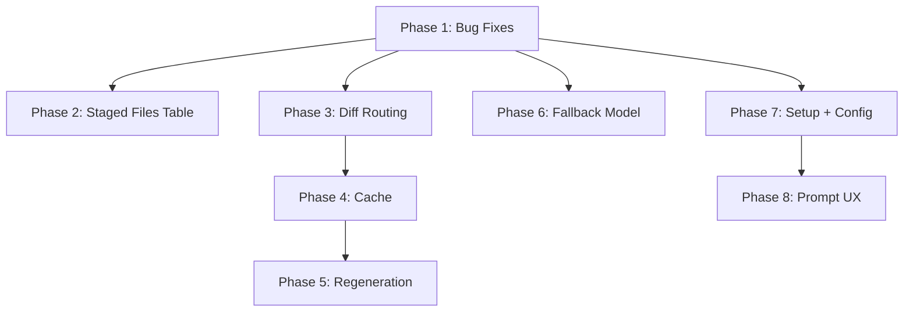

# OpenCommitX Project Improvement Plan

## Root Cause Analysis: Two Separate Cascade Bugs

There are two distinct cascade issues, each with a different cause:

**Bug 1 — "Committing…" cascade + memory leak** (terminal output attached)

Each chunk of `pre-commit` stderr triggers `committingChangesSpinner.start(...)` (line 182 of `[src/commands/commit.ts](src/commands/commit.ts)`) instead of `.message(...)`. The `@clack/prompts` `.start()` method adds a new `keypress` listener to `process.stdin` and renders a fresh spinner line on every invocation. With 7–10 pre-commit hooks, this produces:

- One new line per hook = the cascade you see
- One new `keypress` listener per call = `MaxListenersExceededWarning: 11 keypress listeners`

**Fix:** Replace `.start(...)` with `.message(...)` inside the `proc.stderr.on('data')` handler.

```typescript
// commit.ts line 182 — BEFORE (broken)
committingChangesSpinner.start(`Committing... ${chalk.dim(lastLine.slice(0, 60))}`);

// AFTER (correct)
committingChangesSpinner.message(`Committing... ${chalk.dim(lastLine.slice(0, 60))}`);
```

**Bug 2 — "Generating:" cascade** (inspo_notes.md screenshot)

`genSpinner.message()` is called correctly (line 369–371 of `commit.ts`), but the message contains the full comma-separated file list, which routinely exceeds terminal width. This triggers `[@clack/prompts` bug #132]([https://github.com/bombshell-dev/clack/issues/132](https://github.com/bombshell-dev/clack/issues/132)): when the spinner line is wider than the terminal, clack re-renders a new line on every animation tick.

**Fix:** Truncate the file list to fit terminal width. Use `process.stdout.columns` to cap the message length and show `+N more` for overflow files.

**Memory leak residual hardening:** Even after the `.message()` fix, sequential multi-commit mode creates multiple `spinner()` + `select()` instances across several `performCommit` calls, accumulating listeners. Add `process.stdin.setMaxListeners(process.stdin.getMaxListeners() + 20)` at startup in `cli.ts` as a safe guard to suppress the warning without silencing it globally.

---

## Phase 1 — Bug Fixes (Priority: Ship ASAP)

### 1.1 Fix `.start()` → `.message()` in stderr handler

- File: `[src/commands/commit.ts](src/commands/commit.ts)` line 182
- One-line change: `.start(...)` → `.message(...)`
- Resolves both the cascade and the `MaxListenersExceededWarning`

### 1.2 Fix long "Generating:" spinner message

- File: `[src/commands/commit.ts](src/commands/commit.ts)` lines 365–372
- Extract a helper `truncateFileList(files: string[], maxWidth: number): string` in `src/utils/`
  - Uses `process.stdout.columns ?? 80` minus prefix width as budget
  - Shows first N files that fit, appends `+N more` for overflow
- Apply the same helper to the docstring-mode variant (`Generating (docstring mode): ...`)

### 1.3 Raise stdin MaxListeners guard

- File: `[src/cli.ts](src/cli.ts)`
- Add at top of main: `process.stdin.setMaxListeners(process.stdin.getMaxListeners() + 20)`
- Prevents spurious warnings in sequential mode without masking real leaks

### 1.4 Fix `sequential` mode spinner leak on hook failure

- File: `[src/commands/commit.ts](src/commands/commit.ts)` lines 451–503
- Wrap each `execa` call in `acceptAll` path with `try/finally` to guarantee `committingSpinner.stop()`
- Add `reject: false` guard consistent with `performCommit`

### 1.5 Fix `modelCache.ts` wrong namespace

- File: `[src/utils/modelCache.ts](src/utils/modelCache.ts)`
- Rename `~/.opencommit-models.json` → `~/.opencommitx-data/models.json` (consistent with data dir)

### 1.6 Fix `mlx` provider validation

- File: `[src/commands/config.ts](src/commands/config.ts)`
- Add `'mlx'` to the `OCO_AI_PROVIDER` validator's allowlist

### 1.7 Fix `splitDiff` character vs token split

- File: `[src/generateCommitMessageFromGitDiff.ts](src/generateCommitMessageFromGitDiff.ts)` lines 542–545
- Convert token-sized budget to character budget before `substring` (multiply by ~4 chars/token)

### 1.8 Fix `prompts.ts` module-level config snapshot

- File: `[src/prompts.ts](src/prompts.ts)`
- Move `const config = getConfig()` and `const translation = i18n[...]` inside each exported function so they read runtime config, not import-time snapshot
- This fixes dry-run and test mode stale config bugs

---

## Phase 2 — Upfront Staged-Files Table

Per inspo_notes.md §"Upfront commit flow":

- File: `[src/commands/commit.ts](src/commands/commit.ts)` (near `stagedFilesSpinner` at line 542)
- After building `fileGroups` from `routeDiff`, render a table using `@clack/prompts`'s `note()` or a custom `log.info()` block with columns:
  - File path (truncated)
  - Lines added / removed (from `git diff --numstat`)
  - New file? (Y/N)
  - Docstring mode? (Y/N, only if `OCO_PYTHON_DOCSTRING_MODE=true`)
  - Group # (which commit group this file will be in)
- Source `+/-` numbers from a new `getNumstat(files: string[]): Promise<Map<string, {added: number, removed: number}>>` in `[src/utils/git.ts](src/utils/git.ts)`

---

## Phase 3 — Diff Routing Improvements

Per inspo_notes.md §"Diff routing improvements":

### 3.1 Per-file individual mode

- Add config key `OCO_DIFF_INDIVIDUAL_FILES` (boolean, default false)
- When enabled, each file becomes its own group
- Exception: boilerplate files (`__init__.py`, `index.ts`, `mod.rs`, etc.) are collected into a single `__boilerplate`__ group
- Define boilerplate patterns in `[src/commands/ENUMS.ts](src/commands/ENUMS.ts)` or a new constants file

### 3.2 Structured multi-file output

- When a group contains N>1 files, request structured JSON output: `{"path/to/file.ts": "commit msg", ...}`
- Add a structured output system prompt variant to `[src/prompts.ts](src/prompts.ts)`
- Parse and validate the JSON in `generateCommitMessageByDiff`; fall back to free-text on parse failure

### 3.3 Lock file grouping fix

- File: `[src/utils/diffRouter.ts](src/utils/diffRouter.ts)`
- Lock files (e.g., `pixi.lock`, `package-lock.json`) should be joined to the group containing their associated manifest (`pixi.toml`, `package.json`), not appended to the last group

### 3.4 File grouping review

- Review `routeDiff` logic for large repos (50+ files) where everything collapses into a single group
- Add a max-files-per-group config (`OCO_MAX_FILES_PER_GROUP`, default 10) to split oversized groups

---

## Phase 4 — Cache Improvements

Per inspo_notes.md §"Caching improvement ideas":

### 4.1 Per-file-group cache files

- File: `[src/utils/commitCache.ts](src/utils/commitCache.ts)`
- Change cache key from full-diff hash to per-group diff hash
- Store as `~/.opencommitx-data/<repo>/<group-hash>.json`
- Include in each cache file: `message`, `files`, `model`, `timestamp`

### 4.2 Cache model metadata

- Add `model` field to every cache entry
- When serving a cache hit, if `currentModel !== cachedModel`, show: `Cache hit from ${cachedModel} — regenerate with ${currentModel}?`

### 4.3 Cache lifecycle on commit success

- On successful commit of a group, move its cache file to `~/.opencommitx-data/<repo>/archived/`
- On successful commit, clean up archived entries older than retention period (configurable `OCO_CACHE_RETENTION_DAYS`, default 7)
- Skipped commits retain their cache

### 4.4 Cache validation agent (optional/advanced)

- Add config `OCO_CACHE_VALIDATION_MODEL` for a lightweight model (e.g., `openai/gpt-4o-mini`)
- When a previously-cached file group is re-submitted with a different diff, send both diffs to the validation model to determine if the change is material
- Gate this behind the config key so it's opt-in (adds latency)

---

## Phase 5 — Regeneration Flow

Per inspo_notes.md §"Regeneration":

- In the post-generation `select()` prompt, add a `Regenerate` option
- On select, offer a secondary menu:
  - Adjust verbosity: `More detailed` / `More concise`
  - Switch commit strategy for this run
  - Switch model for this regeneration only
  - Add custom feedback (text input)
- On regeneration, move old cache entry to archive and write new one
- File: `[src/commands/commit.ts](src/commands/commit.ts)` `performCommit` function

---

## Phase 6 — LLM Routing: Fallback Model

Per inspo_notes.md §"LLM routing":

- Add config key `OCO_FALLBACK_MODEL` (and optionally `OCO_FALLBACK_PROVIDER`)
- File: `[src/utils/engine.ts](src/utils/engine.ts)` and `[src/utils/engineErrorHandler.ts](src/utils/engineErrorHandler.ts)`
- On rate-limit or model-not-found error, retry the same request with the fallback model
- Log which model ultimately succeeded; include in cache metadata

---

## Phase 7 — Setup + Config UX

Per inspo_notes.md §"Other setup + config improvements":

### 7.1 Pre-populate current settings in setup wizard

- File: `[src/commands/setup.ts](src/commands/setup.ts)`
- Before each prompt, read current config and pass as `initialValue` / pre-selected option
- API keys should show `[current key set — press Enter to keep]` placeholder

### 7.2 Config file location consolidation

- Move `~/.opencommitx` (INI config) to `~/.opencommitx-data/config.ini`
- Maintain backward-compatibility read from old path with a migration notice
- File: `[src/commands/config.ts](src/commands/config.ts)` and `[src/migrations/](src/migrations/)`

### 7.3 Configurable temperature

- Add config key `OCO_TEMPERATURE` (float 0.0–2.0, default 0.7)
- Pass to all engine adapters in `[src/engine/](src/engine/)`

---

## Phase 8 — Prompt + Runtime Improvements

Per inspo_notes.md §"Prompt improvements" and §"Runtime warnings":

- Add thinking-model warning: if model name contains `thinking`, `think`, `reason`, or `o1`/`o3` prefix, show a `note()` before generation warning of longer execution times
- Add verbosity config `OCO_COMMIT_DETAIL` (`concise` | `normal` | `detailed`, default `normal`) controlling prompt instruction length

---

## Sequencing Summary




Phases 1–2 are independent and should ship first. Phases 3–5 form a chain (routing feeds cache, cache feeds regeneration). Phases 6–8 are independent improvements.