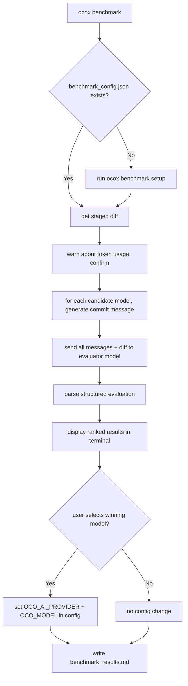
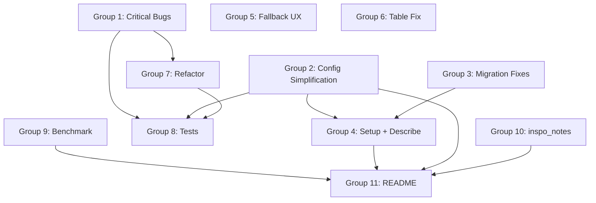

# OpenCommitX Phase 3 Plan

## Root Cause Summary for the Major Testing Issues

- **Symbol(clack:cancel) committed**: `isCancel()` guard is missing in the sequential strategy's `Edit` branch inside `generatePerFileCommits` — the `.toString()` of the cancel symbol becomes the commit message.
- **Cache miss after skip in per-file mode**: `generatePerFileCommits` writes to cache but never reads from it; every re-run calls the LLM unconditionally.
- **build artifact sent to LLM / timeout**: `.opencommitignore` is applied in `getStagedFiles()` but not in `getStagedFilesStats()`, so `out/cli.cjs` (91k lines) passes through `routeDiff` and gets its own group with an enormous diff payload.
- **Cache records wrong model after fallback**: `setCachedCommitMessage` reads `config.OCO_MODEL` at write time, but the fallback `finally` block in `generateCommitMessageByDiff` restores the original config before returning, so the primary (failed) model name lands in the cache.
- **Migration 04 never ran for openrouter users**: `_run.ts` contains an early `return` for 5 providers that skips ALL migrations, not just migration00 as the comment claims.

---

## Group 1 — Critical Bug Fixes

### 1.1 `Symbol(clack:cancel)` as commit message

- **File**: `[src/commands/commit.ts](src/commands/commit.ts)` — sequential Edit branch inside `generatePerFileCommits`
- Add `if (isCancel(textResponse)) process.exit(1);` immediately after the `await text(...)` call, matching the guard already present in `performCommit`.

### 1.2 `.opencommitignore` not applied to `getStagedFilesStats`

- **File**: `[src/utils/git.ts](src/utils/git.ts)`
- In `getStagedFilesStats()`, apply `getOpenCommitIgnore()` to filter out entries before returning, identical to what `getStagedFiles()` already does.
- This prevents ignored files (e.g. `out/cli.cjs`) from appearing in `routeDiff` and being sent as huge diff payloads to the LLM.

### 1.3 Cache never read in per-file generation path

- **File**: `[src/commands/commit.ts](src/commands/commit.ts)` — inside the per-group `for` loop in `generatePerFileCommits`
- Before calling `generateCommitMessageByDiff`, call `getCachedCommitMessage(payload)` and skip the LLM call if a valid entry exists.
- Show the cache hit message and respect the model-mismatch warning already implemented for the aggregate path.

### 1.4 `archiveCacheEntry` missing in per-file path

- After the sequential loop finishes committing, call `archiveCacheEntry(payload)` for each successfully committed group's diff payload, mirroring the aggregate path.

### 1.5 Cache records primary model even when fallback model was used

- **File**: `[src/generateCommitMessageFromGitDiff.ts](src/generateCommitMessageFromGitDiff.ts)`
- Change `generateCommitMessageByDiff` to return `{ message: string; modelUsed: string }` instead of `string`.
- Propagate `modelUsed` to all call sites so `setCachedCommitMessage` records the actual model that produced the response, not the failed primary.
- All callers (commit.ts, per-file loop, aggregate path) need the corresponding update to extract `.message`.

### 1.6 Fix dynamic `require('fs')` inside function bodies

- **File**: `[src/utils/commitCache.ts](src/utils/commitCache.ts)` — `pruneArchivedCache`, `clearCommitCache`
- Replace `const { unlinkSync } = require('fs')` with the static import `import { ..., unlinkSync } from 'fs'` at the top of the file.
- **File**: `[src/commands/config.ts](src/commands/config.ts)` — `setGlobalConfig`
- Replace inline `require('fs')` and `require('path')` with static imports.

---

## Group 2 — Config Key Simplification & Diff Routing Improvements

### 2.1 Threshold confirmation

Verified in `[src/utils/diffRouter.ts](src/utils/diffRouter.ts)` lines 147–152: `OCO_PER_FILE_THRESHOLD_LINES` is compared against `s.added + s.deleted` — the full absolute sum. No change needed. The docstring trigger at line 176 intentionally passes only `s.added` (deleted lines must not inflate the whole-file ratio — see todo.md).

### 2.2 Remove redundant `OCO_DIFF_INDIVIDUAL_FILES`

`OCO_DIFF_INDIVIDUAL_FILES` and `OCO_PER_FILE_COMMIT_MODE=always` are **functionally identical** — same code path, different `reason` string.

**Simplified model (three orthogonal keys):**


| Key                            | Values   | Purpose                                 |
| ------------------------------ | -------- | --------------------------------------- |
| `OCO_PER_FILE_COMMIT_MODE`     | `auto`   | `always`                                |
| `OCO_PER_FILE_THRESHOLD_LINES` | number   | Per-file line threshold for `auto` mode |
| `OCO_MULTI_COMMIT_STRATEGY`    | `single` | `sequential`                            |


- Remove `OCO_DIFF_INDIVIDUAL_FILES` from `CONFIG_KEYS`, `ConfigType`, `DEFAULT_CONFIG`, `getEnvConfig`, `configValidators`, and `diffRouter.ts`.
- In `diffRouter.ts`, the boilerplate-grouping logic at line 121 becomes `if (mode === 'always')` — the existing behavior is already inside that branch, just remove the `|| individualFiles` condition.

### 2.3 Add `OCO_MAX_LINES_PER_GROUP` cap for small-file groups

Currently the small-file group in `auto` mode has no line-count limit: 20 files each with 200 lines all end up in one group (4000 lines total), which is why the user saw everything glommed together.

- Add config key `OCO_MAX_LINES_PER_GROUP` (number, default `1500`).
- When chunking small files, split a chunk whenever the running total of `added + deleted` would exceed this cap (in addition to the existing `OCO_MAX_FILES_PER_GROUP` file-count cap).
- The "all small files" early-return path (line 154) and the normal small-files path (line 186) both need this cap applied.

### 2.4 Subdirectory-aware grouping for small files

Current `chunkFiles()` slices the file array arbitrarily — `src/utils/foo.ts` and `src/engine/bar.ts` may land in the same group even though they are semantically unrelated.

Replace `chunkFiles()` for small-file grouping with a `groupByDirectory()` function:

- Sort files by their directory path first.
- Use greedy bin-packing: accumulate files into the current group as long as neither the count cap (`OCO_MAX_FILES_PER_GROUP`) nor the line cap (`OCO_MAX_LINES_PER_GROUP`) is exceeded.
- When a cap is hit, close the current group and start a new one.
- Files at the same directory depth naturally cluster together.

```typescript
// Example: src/utils/ files group together before mixing with src/engine/
function groupByDirectory(
  stats: FileStats[],
  maxFiles: number,
  maxLines: number
): string[][] { ... }
```

Apply `groupByDirectory` in both the all-small-files path and the mixed (large + small) path in `routeDiff`.

---

## Group 3 — Migration Fixes

### 3.1 Migrations tracking file name

- **File**: `[src/migrations/_run.ts](src/migrations/_run.ts)`
- Rename `migrationsFile` from `~/.opencommit_migrations` → `~/.opencommitx_migrations`.
- Migration logic on first run:
  1. If `~/.opencommitx_migrations` **does not exist** and `~/.opencommit_migrations` **does exist**: copy the old file's entries into the new file (preserves already-completed migration records so they don't re-run), then delete the old file.
  2. If `~/.opencommitx_migrations` **already exists**: do nothing — the new file is authoritative. Delete the old file if it still exists to avoid confusion.
  3. If neither exists: new install, start fresh with an empty list.

### 3.2 Provider early-exit is too broad

- The current `return` at line 49 exits the entire function for `deepseek/groq/mistral/mlx/openrouter` users, skipping all migrations including 04 (config location move).
- Restructure so only migration00 is skipped for those providers; migrations 01–04+ run regardless of provider.

### 3.3 Config location: `getIsGlobalConfigFileExist` semantics

- The function already checks both paths (new + legacy). No change needed.
- Update the `outro` text in the config save confirmation to say `~/.opencommitx-data/config.ini` instead of `~/.opencommitx`.

---

## Group 4 — Setup Wizard & `config describe` Improvements

### 4.1 Fix provider pre-population in `runSetup`

- `@clack/prompts` `select()` has no `initialValue`. Current code marks "(current)" in the label but doesn't scroll to it.
- Solution: Re-order the options array so the current provider appears first. This visually pre-selects it since clack highlights the first option.

### 4.2 Add missing keys to `runFullSetup`

- **File**: `[src/commands/setup.ts](src/commands/setup.ts)`
- The `runFullSetup` function (called by `ocox setup full`) covers 17 of 42 keys. Missing meaningful user-facing keys:
  - **LLM tuning section**: `OCO_TEMPERATURE`, `OCO_COMMIT_DETAIL`, `OCO_FALLBACK_MODEL`, `OCO_FALLBACK_PROVIDER`
  - **Generation timeout**: `OCO_GENERATION_TIMEOUT_SECONDS` (new key)
  - **Commit content**: `OCO_WHY`, `OCO_DEBUG`
  - **Routing**: `OCO_MAX_FILES_PER_GROUP`
- Skip all `OCO_*_KEY` per-provider keys (those are handled in provider setup) and internal keys (`OCO_TEST_MOCK_TYPE`, `OCO_MESSAGE_TEMPLATE_PLACEHOLDER`, etc.).

### 4.3 Thematic ordering in `ocox config describe`

- **File**: `[src/commands/config.ts](src/commands/config.ts)` — `printAllConfigHelp`
- Replace `Object.values(CONFIG_KEYS).sort()` with a hand-ordered array grouped by theme:
  - Provider & Model (`OCO_AI_PROVIDER`, `OCO_MODEL`, `OCO_API_KEY`, `OCO_API_URL`, per-provider keys)
  - Fallback (`OCO_FALLBACK_MODEL`, `OCO_FALLBACK_PROVIDER`)
  - Token limits (`OCO_TOKENS_MAX_INPUT`, `OCO_TOKENS_MAX_OUTPUT`)
  - Generation (`OCO_TEMPERATURE`, `OCO_COMMIT_DETAIL`, `OCO_GENERATION_TIMEOUT_SECONDS`)
  - Commit format (`OCO_DESCRIPTION`, `OCO_WHY`, `OCO_EMOJI`, etc.)
  - Diff routing (`OCO_PER_FILE_COMMIT_MODE`, `OCO_PER_FILE_THRESHOLD_LINES`, `OCO_MAX_FILES_PER_GROUP`, etc.)
  - Multi-commit (`OCO_MULTI_COMMIT_STRATEGY`)
  - Python docstrings (all `OCO_PYTHON_`* keys)
  - Cache (`OCO_CACHE_ENABLED`, `OCO_CACHE_TTL_SECONDS`)
  - Debug & Advanced (`OCO_DEBUG`, `OCO_HOOK_AUTO_UNCOMMENT`, etc.)

### 4.4 Fill in missing `getConfigKeyDetails` cases

- The new keys (`OCO_TEMPERATURE`, `OCO_COMMIT_DETAIL`, `OCO_FALLBACK_MODEL`, `OCO_FALLBACK_PROVIDER`, `OCO_MAX_FILES_PER_GROUP`) currently hit the `default` case with generic descriptions. Add explicit cases with accepted values and examples.

### 4.5 Add `OCO_GENERATION_TIMEOUT_SECONDS` config key

- Default: 90. Type: number. Validator: positive integer.
- Replace the hardcoded `GROUP_TIMEOUT_MS = 90_000` in `commit.ts` with `currentConfig.OCO_GENERATION_TIMEOUT_SECONDS * 1000`.

### 4.6 API key plain-text warning

- When writing a key to the config file (in `setGlobalConfig` or `ocox config set`), display a `note()` once warning that API keys are stored in plain text in the config file.
- Add a note in the README pointing users to `.gitignore` the config file if the data dir is inside a project.

---

## Group 5 — Fallback Model UX Improvements

### 5.1 Better error message for naming convention mismatch

- When the fallback fails, parse the error: if it contains "not a valid model" or "model not found", display: `Fallback model "${model}" was not recognized by provider "${provider}". Different providers use different model naming conventions (e.g. Anthropic uses "claude-3-5-haiku-20241022", OpenRouter uses "anthropic/claude-3-5-haiku"). Set OCO_FALLBACK_PROVIDER to match your fallback model's provider.`

### 5.2 Prompt for fallback provider confirmation on first fallback failure

- If the fallback call fails and `OCO_FALLBACK_PROVIDER` is not set (empty), prompt the user interactively: `Fallback model failed. Set OCO_FALLBACK_PROVIDER? [provider name or Enter to skip]`. If provided, save and retry once.

### 5.3 Prompt for fallback provider API key if missing

- Before making the fallback call, check if the resolved API key for `OCO_FALLBACK_PROVIDER` is set. If not, prompt the user to enter it (showing the API key URL for that provider), save to config, then proceed.

---

## Group 6 — Staged Files Table: Docstring Mode Indicator Fix

- **File**: `[src/commands/commit.ts](src/commands/commit.ts)` — staged files table rendering
- The current implementation checks `g.docstringOverride` (truthy only if extraction succeeded). Replace with `shouldUseDocstringMode(f, statsMap.get(f)?.added ?? 0)` so the DS column shows `Y` for any Python file that meets the docstring trigger conditions — regardless of whether extraction found anything.
- Import `shouldUseDocstringMode` from `../utils/pythonDocstringExtractor`.

---

## Group 7 — `generateCommitMessageFromGitDiff.ts` Refactor

Extract the three nested large-diff strategies into named top-level helpers to reduce the main function from 328 lines to ~130 lines:

- Extract `handlePreprocessedPayload(payload, ...)` → handles the non-raw-diff truncation path (currently lines 242–294)
- Extract `generateWithDocstringFallback(diff, ...)` → handles Python docstring extraction + single LLM call (currently lines 296–363)
- Extract `generateChunked(diff, ...)` → handles chunk-and-join (currently lines 365–391)
- Move `splitDiff`, `getMessagesPromisesByChangesInFile`, `getCommitMsgsPromisesFromFileDiffs`, and `delay` into a new file `src/utils/diffChunking.ts`

This keeps `generateCommitMessageFromGitDiff.ts` focused on orchestration and leaves the chunking utilities importable independently.

---

## Group 8 — Test Suite Buildout

Add to `test/unit/`:


| Test file                  | Covers                                                                                                             |
| -------------------------- | ------------------------------------------------------------------------------------------------------------------ |
| `diffRouter.test.ts`       | boilerplate grouping, lock file attachment, max-files-per-group splitting, `mode=always` vs `auto` vs `never`      |
| `commitCache.test.ts`      | per-group file writes, archive on commit, prune by retention, model-mismatch detection                             |
| `configValidators.test.ts` | validators for `OCO_TEMPERATURE`, `OCO_COMMIT_DETAIL`, `OCO_MAX_FILES_PER_GROUP`, `OCO_GENERATION_TIMEOUT_SECONDS` |
| `commitStrategy.test.ts`   | `OCO_PER_FILE_COMMIT_MODE` + `OCO_MULTI_COMMIT_STRATEGY` interaction matrix                                        |
| `diffChunking.test.ts`     | `splitDiff` character vs token budget, `mergeDiffs` edge cases                                                     |


---

## Group 9 — `ocox benchmark` Command (New Feature)

### Architecture




### Config

Stored in `~/.opencommitx-data/benchmark.json` (not in config.ini — too complex for INI format). Token limits are set per role here rather than using the global config keys, since benchmark runs need much higher budgets:

```json
{
  "eval_model": "anthropic/claude-opus-4-20250514",
  "eval_provider": "openrouter",
  "eval_temperature": 0.1,
  "eval_max_tokens_input": 32000,
  "eval_max_tokens_output": 8000,
  "candidates": [
    {
      "model": "...",
      "provider": "...",
      "temperature": 0,
      "max_tokens_input": 16000,
      "max_tokens_output": 2000
    }
  ]
}
```

The setup wizard walks through all fields. If a candidate's `max_tokens_input`/`max_tokens_output` is not set, fall back to the global `OCO_TOKENS_MAX_INPUT`/`OCO_TOKENS_MAX_OUTPUT` config.

### New files

- `src/commands/benchmark.ts` — main command handler
- `src/utils/benchmarkRunner.ts` — generates messages for each candidate model, calls evaluator
- `src/prompts/benchmark.ts` — evaluator system prompt requesting structured JSON grades

### Evaluator prompt structure

The evaluator receives a single request containing:

- The original diff (full, untruncated)
- All N candidate commit messages labeled by model ID

Instructions request structured JSON with one entry per candidate:

```json
{
  "results": [
    {
      "model": "...",
      "score": 85,
      "accuracy": 9,
      "completeness": 8,
      "missing_key_details": ["did not mention the token budget fix", "omitted the lock file grouping change"],
      "hallucinations": false,
      "hallucination_details": "",
      "conventional_commit_compliance": true,
      "pros": ["clear subject line", "covers the main intent"],
      "cons": ["description is generic"],
      "suggested_improvement": "Add a description line noting the splitDiff char/token fix",
      "overall": "Good message but misses two non-trivial changes..."
    }
  ]
}
```

`removeContentTags` is NOT applied to the evaluator response — preserve `<think>` / reasoning blocks verbatim in `benchmark_results.md`.

### Terminal output

Show per-model: commit message, latency, token counts, cost (if provided in API response). Allow `select()` prompt to pick a winner or skip.

### `benchmark_results.md` output

```markdown
# Benchmark Results — <ISO timestamp>

## Summary
| Rank | Model | Score | Accuracy | Completeness | Hallucinations | Latency | Tokens (in/out) | Cost |
|------|-------|-------|----------|--------------|----------------|---------|-----------------|------|
| 1    | ...   | 92    | 9/10     | 9/10         | No             | 1.8s    | 1200/94         | $0.00038 |
...

## Model: <model-id> — Score: 92/100
**Commit message:**
```

``` **Accuracy:** 9/10 **Completeness:** 9/10 **Missing key details:** none **Hallucinations:** No **Conventional commit compliance:** Yes **Pros:** clear subject, covers primary change **Cons:** description omits the cache fix **Suggested improvement:** ... **Overall assessment:** ...

**E2E latency:** 1.8s
**Tokens (in/out):** 1200 / 94
**Cost:** $0.00038

[Evaluator reasoning preserved verbatim including any  blocks]

---

## Original Diff

```

---

## Group 10 — inspo_notes.md Annotation

- Add `[x]` markers in `xdocs/inspo_notes.md` for all items addressed in Phase 2 and Phase 3.
- Keep unanswered items as `[ ]`.
- The file is listed in `.gitignore` (private), so changes only affect local state.

---

## Group 11 — README & Documentation Updates

- **File**: `[xdocs/README.md](xdocs/README.md)`
- Add new config keys to the Configuration Reference table: `OCO_TEMPERATURE`, `OCO_COMMIT_DETAIL`, `OCO_FALLBACK_MODEL`, `OCO_FALLBACK_PROVIDER`, `OCO_MAX_FILES_PER_GROUP`, `OCO_GENERATION_TIMEOUT_SECONDS`
- Remove `OCO_DIFF_INDIVIDUAL_FILES`
- Add `ocox benchmark` to the Commands section
- Update the cache section to describe per-group file structure
- Add a note about API key plain-text storage

---

## Sequencing




Groups 1–3 are independent of each other and should be completed first. Groups 4–6 depend on G2/G3 being settled. Group 7 (refactor) can proceed after Group 1 bugs are fixed. Group 9 (benchmark) is self-contained. Group 11 (README) is last.