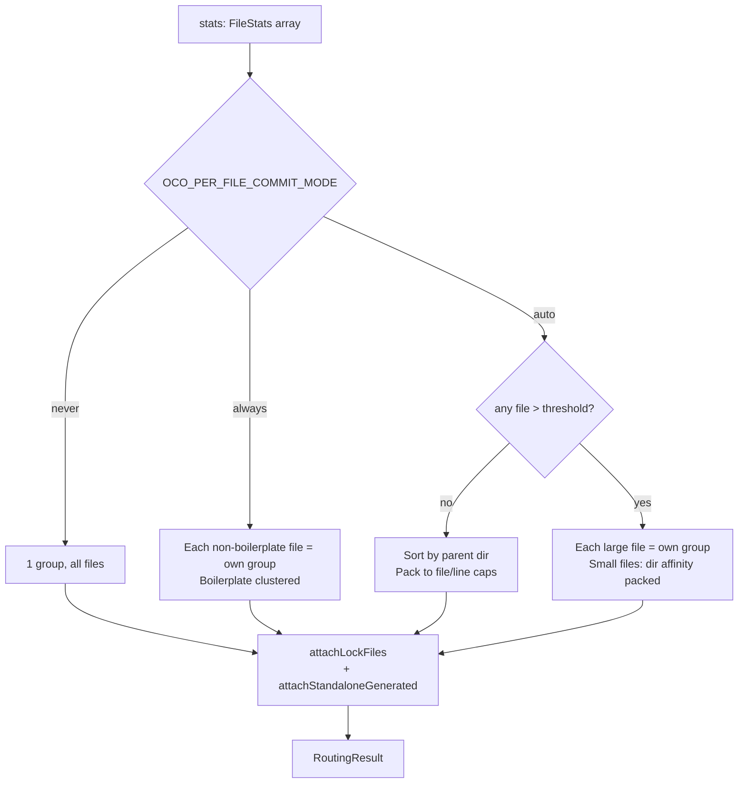

# Smart Diff Router v2 — thematic grouping refactor

**Status:** Draft (planning only — no implementation yet)
**Owner:** xberry1231
**Drafted:** 2026-05-01
**Related:** `xdocs/REVIEW.md` §7.4 (current router behaviour), `.claude/commands/deep-review.md` Pass 4 improvement lens

## Problem statement

The current `auto`-mode diff router (`src/utils/diffRouter.ts:156`) decides per-file vs aggregate using a single threshold (`OCO_PER_FILE_THRESHOLD_LINES`, default 300) and groups small files by **directory affinity** (sort by parent dir, greedy bin-pack to file/line caps).

In practice this is underwhelming because:

1. **Directory adjacency ≠ thematic relevance.** Two unrelated bug fixes that happen to live in the same `src/commands/` end up grouped, while a single thematic change spanning `src/commands/foo.ts` + `src/utils/foo.ts` + `test/unit/foo.test.ts` gets split across three groups.
2. **No semantic awareness.** The router only sees `numstat` (filename + added/deleted line counts). It can't distinguish a `feat` from a `fix` from a `chore`, can't identify themes, and can't tell that two changes share intent.
3. **No file-pair recognition.** Source/test pairs (`foo.ts` ↔ `foo.test.ts`), component/style pairs, schema/migration pairs — all currently treated as independent files in independent groups.
4. **`always` mode is the workaround, but produces commit-volume.** Users who don't trust `auto` flip to `always` and end up with 8 commits where 2 would have been clearer. The user reports "I end up defaulting to per-file commits which results in a lot of volume that doesn't need to happen."
5. **No re-balancing pass.** A 1-file group sitting next to a 2-file group with related theme stays as two groups. There's no "after-the-fact merge" step.

## Goals

- **Make `auto` mode produce thematically coherent groups** so users don't reflexively flip to `always`.
- **Recognise common file-pair conventions** (test ↔ source, component ↔ style, etc.) without user configuration.
- **Provide a semantic-aware option** for users willing to spend a few extra cheap-model tokens on classification.
- **Make the router pluggable** so future strategies (e.g. blame-history clustering) can be added without rewriting the core.
- **Backwards compatibility:** existing `auto`/`always`/`never` semantics keep working; the new behaviour is opt-in initially and becomes default later.
- **Preserve the upfront-table UX** — the staged-files table in `commands/commit.ts:944` should still render cleanly.

## Non-goals

- Building a full taxonomy/embedding system. We're augmenting the existing router, not replacing it with ML.
- Changing the commit-message generation logic itself — only the grouping that feeds it.
- Touching `OCO_MULTI_COMMIT_STRATEGY` (single/sequential) — orthogonal concern.
- Replacing `cleye` or any other framework choice.
- Ripping out directory affinity. It's a reasonable last-resort signal; we just need it to be the last signal, not the only one.

## Current state (anchor)



Strengths to preserve:
- Pure function, easy to unit-test.
- Caps (`OCO_MAX_FILES_PER_GROUP`, `OCO_MAX_LINES_PER_GROUP`) prevent runaway groups.
- Lock-file attachment is reasonable when the manifest is staged.
- Standalone-generated handling (just landed) keeps unrelated assets out of source commits.
- The `_shouldUse` / `_extract` dependency-injection pattern keeps the router testable without mocking.

## Design exploration

Three axes to consider, mostly independent. The recommended path layers them.

### Axis 1 — File-pair recognition (heuristic, no LLM)

Define explicit pair patterns. When two files match a pattern and both are staged, they go in the same group regardless of directory affinity.

Initial patterns to ship:
- `<path>.ts` ↔ `<path>.test.ts` (and `.tsx`/`.spec.ts` variants)
- `test/unit/<name>.test.ts` ↔ `src/<...>/<name>.ts` (cross-directory test pairs — the most common case the current router gets wrong)
- `<name>.ts` ↔ `<name>.types.ts`
- `<name>.tsx` ↔ `<name>.module.css` ↔ `<name>.module.scss`
- `<n>_<name>.ts` migration ↔ `<name>.ts` schema (where N is digits — covers our own `migrations/04_migrate_config_location.ts`)
- `<name>.proto` ↔ generated `<name>.pb.ts`

Behaviour: pairs are merged before the directory-affinity pass, so they survive packing. A pair always counts as one logical unit even if it would push the group past the file cap (with one configurable exception — if the pair itself exceeds caps, fall back to splitting).

Effort: S. Impact: M. This alone would handle most "but the test goes with the source" complaints.

### Axis 2 — Theme inference from path + diff content (heuristic, no LLM)

After pair-merging, infer a theme tag for each remaining file:
- **Path tokens**: split path on `/` and `_`/`-`/camelCase boundaries; collect tokens. `src/utils/commitCache.ts` → `["utils", "commit", "cache"]`.
- **Conventional-keyword sniffing**: scan the diff for additions like `throw new Error` (→ likely `fix`), `export function` (→ likely `feat`), `describe(` / `it(` (→ `test`), `// TODO` / `// FIXME` removals (→ `chore`).
- **Common-token clustering**: files sharing ≥2 path tokens or sharing a Conventional-keyword classification can merge across directories, subject to the existing line/file caps.

Effort: M. Impact: M. Handles the "feature spans `commands/` + `utils/` + `engine/`" case. Not a magic bullet — path tokens are noisy — but a real upgrade over directory affinity alone.

### Axis 3 — Semantic classification via cheap LLM (opt-in)

For each file diff (or each pair), call a fast/cheap model to classify:

```ts
{
  type: 'feat' | 'fix' | 'refactor' | 'test' | 'chore' | 'docs' | 'perf' | 'style' | 'build' | 'ci',
  theme: string,           // free-form short tag like 'auth', 'caching', 'engine-routing'
  magnitude: 'minor' | 'moderate' | 'major'
}
```

Then group by `(type, theme)` tuple; magnitude informs whether to prefer merging vs splitting at the line-cap boundary.

Cost / latency mitigations:
- **Cache classifications by per-file diff hash.** The existing `commitCache` already keys by diff hash — extend its schema with a `classification?` field.
- **Run all classifications in parallel** (these are independent and read-only against the model).
- **Skip classification for tiny diffs** (≤10 lines added+deleted) — they default to nearest neighbour by path tokens.
- **Use `OCO_FALLBACK_MODEL` for classification when set**, since the user has already chosen a cheap fallback for the cost-conscious path.
- **Provide an upper bound** — if the staged diff has >20 files, skip classification entirely and fall back to heuristic-only routing (heuristic is still better than current).

Effort: L. Impact: L (when it works well). Has a real cost trade-off — should be opt-in via config, not the default.

### Axis 4 — Re-balancing post-pass

After grouping (regardless of strategy), run a re-balancing pass:
1. **Merge undersized groups.** If two adjacent groups (in the user's preferred ordering) are both below `~30%` of the line cap and their themes/types are compatible, merge.
2. **Split oversized groups by theme cluster.** Rare but possible when a single theme has 15 files; split into theme + sub-theme.
3. **Quality scoring.** Each group gets a "coherence score" (path-token overlap × type-uniformity). Groups below a threshold get the user's attention via a warning in the upfront table.

Effort: S–M. Impact: M. The "merge undersized" step alone would visibly cut commit volume.

### Axis 5 — UX preview & override

Currently the upfront table (`commands/commit.ts:944`) shows the grouping but is read-only. Make it interactive:
- After the table renders, offer a `select` with options:
  - `Proceed` (default — current behaviour)
  - `Merge groups…` → multi-select which groups to merge
  - `Split file…` → pick a file, move it to its own new group
  - `Re-route with semantic mode` (one-shot, costs the LLM call) — useful when the heuristic result looks wrong

Effort: M. Impact: M. Makes the routing visibly correctable, which is more important than getting it right 100% of the time.

## Recommended approach

**Phase 1 (this plan's primary deliverable): heuristic-only v2.** Axes 1, 2, and 4. No LLM, no UX changes. Drop-in replacement for the current `auto` mode behaviour, behind a new config value:

- Add `OCO_PER_FILE_COMMIT_MODE = 'smart'` (alongside existing `auto`/`always`/`never`).
- `smart` runs: pair-merge → theme cluster → cap-respecting bin-pack → re-balance → attach lock/standalone files.
- Existing `auto` semantics unchanged for backwards compat.
- Eventually (Phase 4 below) `smart` becomes the default value of `auto`, and the literal `auto` mode becomes an alias.

**Phase 2: semantic mode (opt-in).** Axis 3.

- Add `OCO_PER_FILE_COMMIT_MODE = 'semantic'` for users willing to pay the classification call.
- Cache classifications in the existing per-diff cache.
- Use `OCO_FALLBACK_MODEL` when set; otherwise primary model with hard token cap.

**Phase 3: interactive preview.** Axis 5.

- Add `OCO_ROUTING_PREVIEW = true|false|interactive` config.
- Default: `interactive` when stdin is a TTY, `false` in non-interactive contexts (hooks, CI).

**Phase 4: promotion.**

- After Phase 1 has soaked for a few weeks, make `smart` the default behaviour of `auto`. Keep `auto` as an alias; deprecate after one minor version.

## Phased implementation plan

### Phase 1 — heuristic v2 (ship-ready)

| Step | Description | Files affected |
| --- | --- | --- |
| 1.1 | Extract per-strategy implementations from `routeDiff` into `routeDiffNever`, `routeDiffAlways`, `routeDiffAuto` (current behaviour preserved). Single dispatcher `routeDiff(stats, config) → RoutingResult` calls the right one. Pure refactor, no behaviour change. | `src/utils/diffRouter.ts` |
| 1.2 | Add `FilePair` module with patterns + `findPairs(stats: FileStats[]) → Map<string, string>` returning a partner-of mapping. | new `src/utils/filePairs.ts` + tests |
| 1.3 | Add `ThemeInference` module: `inferThemeTokens(file: string) → string[]` (path-based) and `inferTypeFromDiff(diff: string) → ConventionalCommitType \| undefined` (peek at diff content). | new `src/utils/themeInference.ts` + tests |
| 1.4 | Implement `routeDiffSmart(stats, statuses, diffs, config)` that runs: pair-merge → theme-cluster → cap-bin-pack → re-balance. Diffs are needed for Type inference; fetch via `getDiffForFiles(group.files)` per file (cheap — already cached by git). | `src/utils/diffRouter.ts` |
| 1.5 | Add `OCO_PER_FILE_COMMIT_MODE = 'smart'` value. Validator update + describe metadata + thematic-key-order placement (per CLAUDE.md). | `src/commands/config.ts` |
| 1.6 | `commands/commit.ts` upfront table: add `Theme` column when `smart` mode is active. Keep table responsive to `process.stdout.columns`. | `src/commands/commit.ts` |
| 1.7 | Tests: extend `test/unit/diffRouter.test.ts` with smart-mode cases. New unit tests for `filePairs.ts` and `themeInference.ts`. | `test/unit/` |

Estimated effort: M (3–5 days of focused work).

### Phase 2 — semantic mode (opt-in)

| Step | Description |
| --- | --- |
| 2.1 | Add `classifyDiff(diff: string, config) → Classification` in a new `src/utils/diffClassifier.ts`. Calls LLM via `getEngine()`; uses `OCO_FALLBACK_MODEL` when set. Strict Zod schema for the JSON response. |
| 2.2 | Extend `commitCache` schema to optionally store `classification` keyed by per-file diff hash. |
| 2.3 | `routeDiffSemantic(stats, statuses, diffs, config)` — runs `classifyDiff` in parallel, groups by `(type, theme)`, falls back to `routeDiffSmart` on classifier failure or when staged-file count >20. |
| 2.4 | Add `OCO_PER_FILE_COMMIT_MODE = 'semantic'` value + describe + tests. |

Estimated effort: M.

### Phase 3 — interactive preview

| Step | Description |
| --- | --- |
| 3.1 | After staged-files table renders in `commit.ts`, add a `select` with `Proceed`, `Merge…`, `Split…`, `Re-route with semantic` options. |
| 3.2 | Implement merge / split helpers that mutate the `fileGroups` array; re-render the table after each change. |
| 3.3 | `OCO_ROUTING_PREVIEW` config key. |

Estimated effort: M.

### Phase 4 — promotion

- Make `smart` the implementation behind `auto` (one config change, validator unchanged). Document in CHANGELOG.
- Watch for regressions over 1–2 minor versions, then drop the literal `'auto'` distinction.

## Data model changes

```ts
// src/utils/diffRouter.ts

export interface FileGroupResult {
  files: string[];
  totalLines: number;
  docstringOverride?: string;
  // New (phase 1):
  theme?: string;        // e.g. 'utils-cache', 'engine'; undefined when not inferred
  type?: ConventionalCommitType;  // optional hint; undefined when not inferred
  reason?: string;       // 'file-pair', 'theme-cluster', 'directory-affinity', 'cap-split', 'merged-undersized'
  // New (phase 2):
  classification?: Classification;  // when semantic mode ran
  // New (phase 3):
  manuallyAdjusted?: boolean;       // user merged/split this group
}
```

## Config additions

| Key | Type | Default | Purpose |
| --- | --- | --- | --- |
| `OCO_PER_FILE_COMMIT_MODE` | enum | `'auto'` | Add `'smart'` and `'semantic'` values |
| `OCO_ROUTING_PAIR_PATTERNS` | JSON array of glob-pair tuples | `[]` (built-ins always apply) | User-defined extra pair conventions |
| `OCO_ROUTING_PREVIEW` | enum | `'interactive'` (TTY) / `'false'` (non-TTY) | Phase 3 |
| `OCO_ROUTING_THEME_MIN_TOKENS` | int | `2` | Min shared path tokens to consider files thematically related |
| `OCO_ROUTING_REBALANCE_THRESHOLD` | float 0–1 | `0.3` | Below this fraction of cap, try merging undersized groups |

All new keys flow through the existing checklist in `CLAUDE.md` (validator, describe, thematic order, env bridge).

## Test strategy

### Unit (Phase 1)
- `filePairs.test.ts` — coverage of every built-in pair pattern, cross-directory pairs, user-defined patterns.
- `themeInference.test.ts` — path-token extraction edge cases (camelCase, underscores, scoped npm packages); diff-content type sniffing fixtures.
- `diffRouter.test.ts` smart-mode additions:
  - Test/source pair across `test/unit/` ↔ `src/utils/` stays in one group
  - Two unrelated files in same dir do NOT merge when no theme overlap
  - Cross-directory thematic group (e.g. `commands/cache.ts` + `utils/cache*.ts`) merges
  - Re-balance merges undersized adjacent groups but not when types conflict

### Property-based (per deep-review.md Pass 5 lens)
- `fast-check` over arbitrary `FileStats[]` invariants:
  - Output groups partition the input (no file lost, no file duplicated)
  - Every group respects `OCO_MAX_FILES_PER_GROUP` and `OCO_MAX_LINES_PER_GROUP` (modulo the documented pair-overrides-cap exception)
  - Lock files always end up co-grouped with their manifest when both are staged

### Integration (Phase 1 ship gate)
- One e2e test that stages a realistic mixed change (a feature with test + source + docs across 3 directories) and asserts the resulting group count.

### Regression guard
- Existing `routeDiff` tests stay green. The default `OCO_PER_FILE_COMMIT_MODE = 'auto'` continues to use the existing implementation until Phase 4 promotion.

## Risks & rollback

| Risk | Mitigation |
| --- | --- |
| New heuristics produce worse groupings than current `auto` for some users | Ship as opt-in `'smart'` mode for Phase 1; users keep `auto` until promotion. |
| Pair patterns false-positive (e.g. unrelated `foo.ts` + `foo.test.ts` from different features) | Pattern definitions are explicit allowlist, not generic regex; each pattern has a dedicated test fixture. |
| Theme inference produces incoherent `theme` strings shown in UI | `theme` is internal-only by default; only surfaced in the upfront table behind a feature flag. |
| Semantic mode (Phase 2) costs surprise users | Hard-cap at 20 staged files; clear logging of classifier-call count; hidden behind explicit config opt-in; respect `--dry-run` (no classifier calls). |
| Interactive preview blocks non-TTY contexts (git hooks, CI) | Default to `false` when `!process.stdout.isTTY`; explicit override available. |

Rollback for Phase 1: `OCO_PER_FILE_COMMIT_MODE='auto'` remains the default and the existing implementation is untouched. Removing `smart` is a single delete-the-case in the dispatcher plus the validator/describe entries.

## Open questions

1. **Should pair-merging override the line cap?** Currently leaning yes (a 600-line source + 200-line test should commit together even if the cap is 1500 — they're one logical change). But what about a 1500-line source + 600-line test? Do we split, and if so how?
2. **Theme inference: how much should diff content vs path matter?** A pure path-based system is cheap and predictable; mixing in diff-content sniffing makes results harder to explain to users. Considering a strict precedence: path tokens first, diff content only as tiebreaker.
3. **Should the upfront table show the routing reason?** ("Merged via test-pair", "directory affinity", "theme cluster"). Helpful for debugging but adds a column. Maybe behind `OCO_DEBUG`.
4. **Conventional-commit type hints to the LLM:** if Phase 2 lands, should the inferred `type` be passed as a prompt hint? Pro: more consistent commit prefixes. Con: anchoring bias if the classifier got it wrong.
5. **Interaction with `OCO_MULTI_COMMIT_STRATEGY`:** in `single` strategy, grouping doesn't really matter — messages are joined. Should `smart` mode hint the user that `sequential` strategy makes more sense given the proposed groups?

## Done criteria for Phase 1

- `OCO_PER_FILE_COMMIT_MODE='smart'` is usable end-to-end on a realistic staged change.
- Test/source pairs always group together, regardless of directory.
- A change spanning `commands/` + `utils/` with shared theme tokens groups into one logical unit instead of two directory-affinity groups.
- All existing `diffRouter.test.ts` cases still pass under default `auto`.
- New tests cover every built-in pair pattern.
- Upfront table renders cleanly with the optional `Theme` column.
- The user runs `ocox` on a real multi-file change and the resulting grouping is something they'd accept without flipping to `always`.

## Out-of-scope for this plan (parking lot)

- Learning from user merge/split history (Phase 5+)
- Git-blame-based "files frequently committed together" clustering
- Multi-language theme inference beyond TS/JS path conventions
- Integration with `ocox benchmark` to A/B test routing strategies
